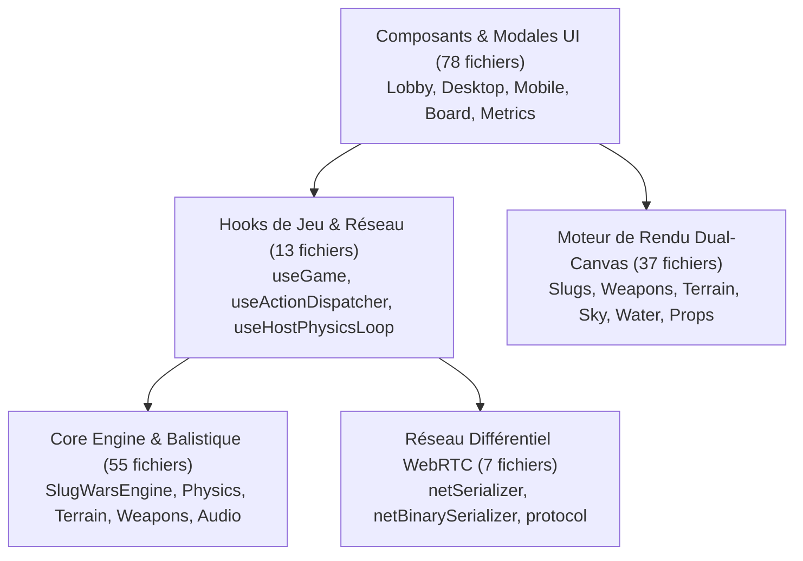

# Rapport d'Audit Critique - Qualité, Organisation & Robustesse

> **Projet** : `slugwars-p2play`  
> **Date** : Août 2026  
> **Périmètre audité** : 192 fichiers sources TypeScript / React (100% de la base de code `src/`)  
> **Couverture de tests** : 34 suites de tests / 373 tests unitaires passants (100% de réussite)

---

## 🎯 1. Note Globale & Diagnostic

### **Note : 8.4 / 10**

> **Diagnostic en 3 lignes :**
> 1. **Fondations architecturales & modularité exemplaires** : 100% des fichiers sources respectent la règle stricte des `< 300 lignes` avec une séparation nette des responsabilités (*Domain*, *Network*, *Rendering*, *UI*).
> 2. **Excellence temps réel (Dual Canvas & Web Workers)** : Le moteur physique 50ms sur Worker Timer et le rendu adaptatif 60 FPS (DRS + couche action 1.0x) assurent une réactivité fluide.
> 3. **Dettes techniques et anti-patterns ciblés** : Présence de monkey-patching statique sur React (`SlugWarsCanvas`), mutations d'objets dynamiques à 60 FPS contournant les optimisations V8, variables globales mutables dans le sérialiseur binaire, et prop-drilling de 25 handlers d'actions.

---

## 🏛️ 2. Cartographie & Points Forts par Couche



### 1. Core Engine & Physique (`src/core/` - 55 fichiers)
* **Physique découplée par entité** : Modules spécialisés pour les limaces (`slugPhysics.ts`), projectiles (`projectilePhysics.ts`), hélicoptères (`vehiclePhysics.ts`) et explosions (`explosionPhysics.ts`).
* **Terrain procédural déterministe** : 8 archétypes procéduraux manipulables directement via une grille compacte `Uint8Array`.
* **Boucle physique 50ms en Web Worker** : `workerTimer.ts` élimine tout gel ou ralentissement de simulation lors de la mise en veille des onglets de navigateur.

### 2. Réseau & Sérialisation Différentielle (`src/network/` - 7 fichiers)
* **Différentiel 20Hz optimisé** : Seuls les champs modifiés sont diffusés via `stateDeltaBuilder.ts`.
* **Encodage binaire compact** : `netBinarySerializer.ts` compresse les nombres et tableaux (`TAG_NULL`, `TAG_FLOAT32`, `TAG_ARRAY`).
* **Régulation du débit** : Throttling à 30Hz de la visée (`AIM`) sur WebRTC avec flush automatique lors des tirs.

### 3. Moteur de Rendu Dual-Canvas (`src/rendering/` - 37 fichiers)
* **Dual-Canvas haute performance** :
  * *Canvas de fond* : Ciel, montagnes, océan et terrain à résolution dynamique adaptative (DRS).
  * *Canvas d'action* : Limaces, armes, réticule, dégâts flottants et particules en 1.0x DPR net.
* **Optimisations mémoire** : Tableaux typés pré-alloués pour les ondes d'eau (`renderWater.ts`) et mise en cache des gradients.

### 4. Hooks & Gestion d'État (`src/hooks/` - 13 fichiers)
* **Prédiction client 0ms** : Mise à jour optimiste immédiate côté invité pour la visée, la charge de tir, le déplacement et le saut.
* **Résilience réseau** : Reprise automatique de synchronisation en cas de changement d'onglet (`useVisibilityRecovery.ts`).

### 5. Composants UI & Expérience Utilisateur (`src/components/` - 78 fichiers)
* **Ergonomie multi-plateforme** : Interfaces Desktop (volet de combat, dock tactique) et Mobile (clusters pouce gauche/droit) dédiées.
* **Télémétrie intégrée** : Inspecteur de trafic réseau et profiler matériel embarqué (`PerfCaptureTab.tsx`).

---

## ⚠️ 3. Faiblesses & Anti-Patterns Identifiés

### 🔴 Anti-Pattern 1 : Monkey-Patching statique sur `SlugWarsCanvas`

* **Fichier** : `src/components/game/SlugWarsCanvas.tsx` (L187-194 & L266-268)
* **Problème** : Pour contourner le cycle de re-rendu React à 20Hz sans re-monter le Canvas, une méthode est greffée dynamiquement sur l'objet fonction `SlugWarsCanvas`. C'est un anti-pattern qui casse le modèle déclaratif React, crée un singleton caché et pose des problèmes avec le Fast Refresh.

```typescript
// ❌ CODE ACTUEL (SlugWarsCanvas.tsx)
useEffect(() => {
  (SlugWarsCanvas as any)._updateExternalState = (nextState: GameState) => {
    gameStateRef.current = nextState;
  };
  return () => {
    delete (SlugWarsCanvas as any)._updateExternalState;
  };
}, []);

export const SlugWarsCanvas = React.memo(SlugWarsCanvasComponent, (prev, next) => {
  (SlugWarsCanvas as any)._updateExternalState?.(next.gameState);
  return prev.terrain === next.terrain && ...;
});
```

* **Correction recommandée** : Passer directement `gameStateRef: React.MutableRefObject<GameState>` en prop depuis le parent.

```typescript
// ✅ CODE CORRIGÉ
export interface SlugWarsCanvasProps {
  gameStateRef: React.MutableRefObject<GameState>;
  terrain: DestructibleTerrain;
  isMyTurn: boolean;
  // ...
}
```

---

### 🔴 Anti-Pattern 2 : Mutation dynamique d'objets à 60 FPS (`(obj as any)._prop`)

* **Fichiers** :
  * `src/rendering/props/renderDestructibleProp.ts` (L56-73)
  * `src/rendering/props/renderGirder.ts` (L23-41)
  * `src/rendering/renderProjectiles.ts` (L35)
* **Problème** : Des propriétés non déclarées (`_lastFoundationRev`, `_isFoundationSolid`, `interpolatedAngle`) sont assignées directement sur les objets du domaine de jeu pendant la boucle de rendu Canvas à 60 FPS. Cela dé-optimise les structures d'objets internes de V8 (*Hidden Classes megamorphism*) et oblige à utiliser `as any`.

```typescript
// ❌ CODE ACTUEL (renderDestructibleProp.ts)
if (terrainRevision !== undefined && (sprop as any)._lastFoundationRev === terrainRevision) {
  if (!(sprop as any)._isFoundationSolid) return;
}
(sprop as any)._lastFoundationRev = terrainRevision;
(sprop as any)._isFoundationSolid = solidFoundationCount > 0;
```

* **Correction recommandée** : Utiliser des `WeakMap` locales au module de rendu (collectées automatiquement par le Garbage Collector) :

```typescript
// ✅ CODE CORRIGÉ
interface FoundationCache {
  revision: number;
  isSolid: boolean;
}

const foundationCache = new WeakMap<SolidProp, FoundationCache>();

export function renderDestructibleProp(...) {
  const cached = foundationCache.get(sprop);
  if (terrainRevision !== undefined && cached?.revision === terrainRevision) {
    if (!cached.isSolid) return;
  }
  // ... calcul de solidité
  foundationCache.set(sprop, { revision: terrainRevision ?? 0, isSolid: solidFoundationCount > 0 });
}
```

---

### 🔴 Anti-Pattern 3 : Variables globales mutables non réentrantes dans `netBinarySerializer`

* **Fichier** : `src/network/netBinarySerializer.ts` (L52-56)
* **Problème** : `sharedBuffer`, `sharedView`, `sharedU8` et `offset` sont déclarés en variables globales au niveau du module. Si une sérialisation déclenche une getter ou une sous-opération imbriquée, `offset` sera écrasé, corrompant les paquets WebRTC.

```typescript
// ❌ CODE ACTUEL (netBinarySerializer.ts)
let sharedBuffer = new ArrayBuffer(8192);
let sharedView = new DataView(sharedBuffer);
let sharedU8 = new Uint8Array(sharedBuffer);
let offset = 0;

export function serializeToBinary(data: any): Uint8Array {
  offset = 0;
  writeValue(data);
  return sharedU8.slice(0, offset);
}
```

* **Correction recommandée** : Encapsuler le buffer dans une classe d'écriture réentrante `BinaryWriter` :

```typescript
// ✅ CODE CORRIGÉ
export class BinaryWriter {
  private buffer = new ArrayBuffer(8192);
  private view = new DataView(this.buffer);
  private u8 = new Uint8Array(this.buffer);
  private offset = 0;

  public write(val: unknown): Uint8Array {
    this.offset = 0;
    this.writeValue(val);
    return this.u8.slice(0, this.offset);
  }
  // ...
}
```

---

### 🔴 Anti-Pattern 4 : Prop Drilling massif de 25 callbacks dans `SlugWarsBoard`

* **Fichier** : `src/components/game/SlugWarsBoard.tsx` (L24-51)
* **Problème** : `SlugWarsBoard` déclare 25 props d'actions distinctes (`onFire`, `onJump`, `onStartMove`, `onStopMove`, `onStartCharge`, `onReleaseCharge`, `onDetonate`, `onEnterVehicle`, etc.) qui ne font que passer l'appel à `sendAction(name, payload)`. Cela crée un couplage fort et alourdit la maintenance.

```typescript
// ❌ CODE ACTUEL (SlugWarsBoard.tsx)
interface SlugWarsBoardProps {
  onFire: (targetPoint?: Vector2D) => void;
  onPlaceSlug?: (point: Vector2D) => void;
  onUpdateAim: (aimAngle: number, aimPower: number, facing: 'left' | 'right', targetPoint?: Vector2D) => void;
  onSelectWeapon: (weaponId: string) => void;
  onSetFuseTimer?: (seconds: number) => void;
  onStartMove: (dir: 'left' | 'right') => void;
  onStopMove: () => void;
  onJump: () => void;
  // ... 17 autres callbacks
}
```

* **Correction recommandée** : Unifier sous un type discriminant `GameAction` et un dispatcher unique :

```typescript
// ✅ CODE CORRIGÉ
export type GameAction =
  | { type: 'FIRE'; targetPoint?: Vector2D }
  | { type: 'AIM'; aimAngle: number; aimPower: number; facing: 'left' | 'right'; targetPoint?: Vector2D }
  | { type: 'SELECT_WEAPON'; weaponId: string }
  | { type: 'SET_FUSE_TIMER'; seconds: number }
  | { type: 'MOVE'; dir: 'left' | 'right' | null }
  | { type: 'JUMP' }
  | { type: 'VEHICLE_STEER'; dir: 'left' | 'right' | 'up' | 'down' };

interface SlugWarsBoardProps {
  dispatchAction: (action: GameAction) => void;
}
```

---

## 🏆 4. Top 3 des Refactorisations Prioritaires

| Rang | Cible Prioritaire | Bénéfice & Impact | Effort estimé |
| :---: | :--- | :--- | :---: |
| 🥇 **1** | **Assainissement de `SlugWarsCanvas`**<br/>*(Suppression du monkey-patching `_updateExternalState`)* | Restaure le modèle déclaratif React, élimine tout risque de fuite mémoire en multi-instance et fiabilise le cycle de vie du Canvas. | **Faible** (~30 min) |
| 🥈 **2** | **Migration des mutations `(obj as any)._prop` vers des `WeakMap`** | Typage strict à 100% sans `any`, préservation des *hidden classes* V8 et gain de régularité du frame-rate à 60 FPS. | **Moyen** (~45 min) |
| 🥉 **3** | **Unification du Dispatcher d'actions dans `SlugWarsBoard`** | Réduction drastique du code boilerplate, élimination de 25 props répétitives et centralisation des actions du jeu. | **Moyen** (~1h) |

---

## 📊 5. Synthèse Métrique du Codebase

| Métrique | Valeur |
| :--- | :---: |
| **Nombre total de fichiers sources** | **192 fichiers** |
| **Fichiers dépassant 300 lignes** | **0 fichier (0%)** |
| **Suites de tests unitaires** | **34 suites** |
| **Tests unitaires passants** | **373 tests (100%)** |
| **Temps d'exécution des tests** | **~4.5 secondes** |
| **Builds Standalone & Lib** | **Validés (0 erreur TS)** |
