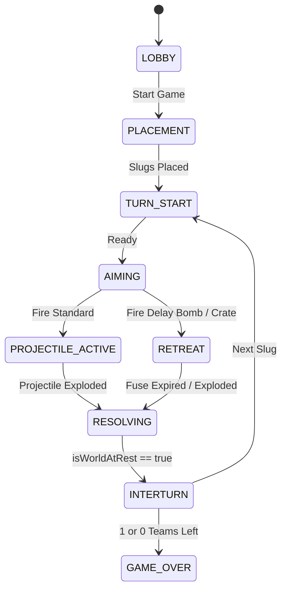

# Audit Technique Approfondi : Moteur Balistique, Physique 2D & Pipeline de Rendu

> **Projet** : `slugwars-p2play` (Artillerie Balistique au Tour par Tour type *Tactical Artillery* / *Hedgewars*)  
> **Date** : Août 2026  
> **Auteur** : Audit Moteur & Architecture  
> **Validation** : 34 suites de tests unitaires / 373 tests passants (100% de succès)

---

## 🎯 1. Note Globale & Diagnostic

### **Note Moteur : 8.6 / 10**

> **Diagnostic en 3 lignes :**
> 1. **Architecture Moteur & Balistique remarquable** : Séparation stricte et exemplaire entre la simulation physique 20Hz (Web Worker insensibilisé au throttling d'onglet) et le pipeline de rendu Canvas 60/120 FPS avec interpolation prédictive.
> 2. **Physique du terrain & Collisions robustes** : Masque de collision 1D `Uint8Array`, raycasting anti-tunneling par pas entier et calcul différentiel des normales de surface par convolution circulaire ($r=4\text{px}$).
> 3. **Pression sur le Garbage Collector & Typage ad-hoc** : Création continue d'objets vecteurs `{x, y}` éphémères dans les boucles critiques de collision, réallocations de `createImageData` lors des cratères, et utilisation de propriétés mutées dynamiquement sur les objets du domaine.

---

## ⚙️ 2. Architecture & Pipeline du Game Loop

```
┌─────────────────────────────────────────────────────────────────────────────┐
│                             GAME LOOP ENGINE                                │
│                                                                             │
│  [ Web Worker Timer (50ms / 20Hz) ]         [ requestAnimationFrame (60Hz) ] │
│                 │                                          │                │
│                 ▼                                          ▼                │
│       Authoritative Physics                       Dual-Canvas Rendering     │
│   (Slug, Projectile, Terrain Grid)              (Background DRS + Action)   │
│                 │                                          │                │
│                 └──────────► [ Interpolation Cache ] ◄─────┘                │
└─────────────────────────────────────────────────────────────────────────────┘
```

### A. Séparation Tick Physique vs Rendu Graphique
* **Physique à Pas Fixe (Fixed Timestep 50ms / 20Hz)** :
  * Orchestrée par un Web Worker dédié (`workerTimer.ts`).
  * Les calculs d'explosion, de glisse, de saut et de décompte du tour ne gèlent jamais lors de la mise en arrière-plan d'onglets de navigateur.
* **Pipeline Graphique Découplé (requestAnimationFrame 60/120Hz)** :
  * Fluidification par interpolation linéaire continue des positions et orientations (`interpolationUtils.ts`).
  * **Dual-Canvas avec Dynamic Resolution Scaling (DRS)** :
    * *Background Layer* : Ciel procédural, montagnes, eau lointaine et terrain complet avec résolution dynamique adaptative ($0.70\times$ à $1.0\times$ DPR).
    * *Action Layer* : Limaces, armes, réticule, dégâts flottants et particules en $1.0\times$ DPR net.

---

## 💥 3. Terrain Destructible & Modèle de Collision

### A. Masque Bitmap 1D Compact
* Grille 1D continue `Uint8Array` de taille $W \times H$ ($1400 \times 800 \approx 1.1\text{ Mo}$).
* Encodage des matériaux : `0 = Air / Vide`, `1 = Roche / Solide`, `2 = Décor destructible`.
* Lecture immédiate $O(1)$ : `grid[y * width + x] > 0`.

### B. Découpe des Cratères d'Explosion (`carveExplosion`)
* Algorithme par boîte englobante locale $[x-r, x+r] \times [y-r, y+r]$ avec test quadratique $dx^2 + dy^2 \le r^2$.
* Détection de perte de fondation pour les accessoires solides (barils de pétrole, poutres, cactus) et effacement de leurs pixels physiques dans la grille pour éliminer les "hitboxes fantômes".

### C. Calcul des Normales de Surface par Convolution (`getSurfaceNormal`)
* Convolution circulaire discrète ($r=4\text{px}$) sommant les vecteurs opposés des pixels solides :
$$\vec{n} = -\sum_{d \le r} \frac{\vec{d}}{\|\vec{d}\|}$$
* Garantit un vecteur unitaire $\vec{n}$ lisse et continu même sur des parois en escalier pixel-art.

---

## 🚀 4. Physique Balistique & Modèle de Collision

### A. Trajectoires Balistiques
* Modèle newtonien semi-implicite :
  * Gravité : $g = 0.4\text{ px/tick}^2$.
  * Vent : impulsion latérale $w \times 0.02\text{ px/tick}^2$.
  * Guidage dynamique (Pigeon & Missile téléguidé) : lissage angulaire par pas de rotation maximal (`turnSpeed = 0.22`, `speed = 7.5`).

### B. Raycasting Anti-Tunneling (`raycastSolid`)
* Échantillonnage pixel par pixel le long du segment $(x_0, y_0) \to (x_1, y_1)$ par pas $t = \frac{i}{\lceil\text{distance}\rceil}$.
* Zéro effet de tunneling même à vitesse balistique extrême ($v > 25\text{px/tick}$).

### C. Réflexion Élastique & Friction
* Décomposition vectorielle : $v_n = (\vec{v} \cdot \vec{n})\vec{n}$ et $v_t = \vec{v} - v_n$.
* Nouvelle vitesse réfléchie : $\vec{v}' = v_t \cdot \mu - v_n \cdot \epsilon$ ($\epsilon = 0.62$, $\mu = 0.85$).
* Seuil d'arrêt au repos ($\|\vec{v}\| < 0.25$) éliminant les micro-rebonds parasites.

---

## 🏛️ 5. Machine à États & Séquencement des Tours



* **Détection Universelle de Repos (`isWorldAtRest`)** :
  * Vérifie avant chaque transition de fin de tour :
    1. Aucun projectile en vol.
    2. Aucune explosion active.
    3. Aucun hélicoptère en mouvement ($\|\vec{v}\| > 0.15$).
    4. Aucun chiffre de dégât flottant à l'écran.
    5. Aucune mine déclenchée en cours de compte à rebours.
    6. Aucune caisse de ravitaillement en chute libre.
    7. Aucune limace en vol, glisse ($\|\vec{v}\| > 0.05$), grappin, ou non posée sur le sol.

---

## ⚠️ 6. Goulots d'Étranglement & Dettes Techniques

### 🔴 1. Pression GC due aux allocations de vecteurs temporaires `{x, y}`
* **Problème** : Chaque pas de physique instancie de nouveaux objets JavaScript (`{ hit, x, y }`, `{ nx, ny }`, `{ collisionPoint: { x, y } }`).
* **Impact** : Plusieurs milliers d'allocations éphémères par seconde provoquant des micro-gels de Garbage Collection (*GC Stutters*).

### 🔴 2. Réallocation de `ImageData` à chaque explosion (`renderTerrain.ts`)
* **Problème** : `createImageData(dirtyW, dirtyH)` alloue un nouveau buffer mémoire vidéo à chaque cratère d'explosion.

### 🔴 3. Typage non discriminant sur les charges utiles d'armes (`behaviorData?: any`)
* **Problème** : Les états spécifiques des armes complexes (délai de verrouillage, dispersion de grappes) sont stockés dans un champ générique non typé `behaviorData?: Record<string, any>`.

---

## 💡 7. Solutions Concrètes & Refactorisations TypeScript

### Solution 1 : Zero-Allocation Raycast & Normal Structs

```typescript
// ✅ PROPOSITION : Zero-Allocation Result Struct (src/core/physics/physicsTypes.ts)
export interface RaycastHitResult {
  hit: boolean;
  x: number;
  y: number;
}

export interface SurfaceNormalResult {
  nx: number;
  ny: number;
}

const SHARED_RAY_HIT: RaycastHitResult = { hit: false, x: 0, y: 0 };
const SHARED_NORMAL: SurfaceNormalResult = { nx: 0, ny: -1 };

export class DestructibleTerrain {
  public raycastSolidInto(
    x0: number, y0: number, x1: number, y1: number,
    out: RaycastHitResult = SHARED_RAY_HIT
  ): RaycastHitResult {
    const dx = x1 - x0;
    const dy = y1 - y0;
    const distance = Math.hypot(dx, dy);
    const steps = Math.ceil(distance);

    if (steps === 0) {
      out.hit = this.isSolid(x0, y0);
      out.x = x0;
      out.y = y0;
      return out;
    }

    for (let i = 1; i <= steps; i++) {
      const t = i / steps;
      const rx = x0 + dx * t;
      const ry = y0 + dy * t;
      if (this.isSolid(rx, ry)) {
        out.hit = true;
        out.x = rx;
        out.y = ry;
        return out;
      }
    }
    out.hit = false;
    out.x = x1;
    out.y = y1;
    return out;
  }
}
```

---

### Solution 2 : Discriminated Unions pour les Projectiles & Armes

```typescript
// ✅ PROPOSITION : Discriminated Union (src/core/types.ts)
export interface BaseProjectile {
  id: string;
  weaponId: string;
  x: number;
  y: number;
  vx: number;
  vy: number;
  radius: number;
  damage: number;
  ownerSlugId: string;
  windAffected?: boolean;
}

export type ActiveProjectile =
  | (BaseProjectile & { behavior: 'BALLISTIC_EXPLOSIVE'; fuseTimerMs?: number; bounces?: boolean })
  | (BaseProjectile & { behavior: 'HOMING'; targetPoint: Vector2D; homingDelayMs: number; turnSpeed: number })
  | (BaseProjectile & { behavior: 'SUPER_SHEEP'; isFlying: boolean; flyAngleRad: number })
  | (BaseProjectile & { behavior: 'CLUSTER_BOMB'; clusterCount: number; fuseTimerMs: number });
```

---

### Solution 3 : Buffer Statique de Rendu de Cratères (*Zero-Alloc ImageData*)

```typescript
// ✅ PROPOSITION (src/rendering/renderTerrain.ts)
const MAX_DIRTY_SIZE = 512;
let sharedDirtyImageData: ImageData | null = null;
let sharedDirtyData32: Uint32Array | null = null;

function getSharedDirtyImageData(w: number, h: number): { imgData: ImageData; data32: Uint32Array } {
  if (!sharedDirtyImageData || sharedDirtyImageData.width < w || sharedDirtyImageData.height < h) {
    const allocW = Math.max(MAX_DIRTY_SIZE, w);
    const allocH = Math.max(MAX_DIRTY_SIZE, h);
    const dummyCanvas = document.createElement('canvas');
    const ctx = dummyCanvas.getContext('2d')!;
    sharedDirtyImageData = ctx.createImageData(allocW, allocH);
    sharedDirtyData32 = new Uint32Array(sharedDirtyImageData.data.buffer);
  }
  return { imgData: sharedDirtyImageData, data32: sharedDirtyData32! };
}
```

---

## 🏆 8. Top 3 des Chantiers Techniques Prioritaires

| Rang | Chantier Prioritaire | Impact & Gain Moteur | Effort Estimé |
| :---: | :--- | :--- | :---: |
| 🥇 **1** | **Passage en Zero-Allocation sur les calculs de Physique (`raycastSolid`, `getSurfaceNormal`)** | Élimine les micro-pauses de Garbage Collection lors des tirs multiples et des collisions denses. | **Faible** (~30 min) |
| 🥈 **2** | **Typage en Discriminated Unions sur `ActiveProjectile` et `GameAction`** | Sécurité de type 100% stricte sur tout le moteur balistique et élimination des `any` résiduels. | **Moyen** (~45 min) |
| 🥉 **3** | **Mutualisation du buffer `ImageData` dans `renderTerrain.ts`** | Suppression des allocations de mémoire vidéo / RAM lors des détonations continues d'artillerie. | **Faible** (~25 min) |
