# 🛡️ Charte de Qualité Logicielle & Bonnes Pratiques (Code Quality)

> **Projet** : `slugwars-p2play` (Artillerie Balistique 2D Multijoueur P2P)  
> **Dernière mise à jour** : Août 2026  
> **Statut de Conformité** : **100% Validé (501 tests unitaires passants / 0 régression)**

---

## 📖 1. Manifeste & Objectifs

La présente charte définit les **standards d'ingénierie logicielle non négociables** du projet SlugWars. Elle a pour but de garantir :
1. **Un framerate constant à 60/144 FPS** sans aucun micro-gel du *Garbage Collector*.
2. **Un déterminisme mathématique absolu** éliminant tout risque de désynchronisation WebRTC en P2P.
3. **Un codebase modulaire, lisible et maintenable**, où chaque fichier remplit une responsabilité unique.
4. **Une sécurité de typage statique complète** assistée par le compilateur TypeScript.

---

## 🏛️ 2. Les 8 Piliers Inviolables du Code Quality

```mermaid
graph TD
    P1["1. Règle des < 300 lignes<br/>(100% des fichiers conformes)"]
    P2["2. Clean Architecture en 4 Couches<br/>(Domain / Network / Rendering / UI)"]
    P3["3. Approche TDD & Tests Exhaustifs<br/>(501 tests unitaires validés)"]
    P4["4. Moteur Zero-Alloc & Performance V8<br/>(Zéro instanciation dans la boucle physique)"]
    P5["5. Typage Strict & Discriminated Unions<br/>(noImplicitAny: true, GameAction)"]
    P6["6. Architecture Data-Driven O(1)<br/>(Tables de dispatch sans switch)"]
    P7["7. Rendu Déclaratif & HiDPI Retina<br/>(Zéro monkey-patch, DPR natif)"]
    P8["8. Intégrité du Double Build Continu<br/>(App Standalone + Lib NPM)"]
```



---

### 1. 📏 Règle Absolue des `< 300 lignes` par Fichier
* **Aucun fichier source de production dans `src/` ne doit dépasser 300 lignes.**
* Si un composant ou un module approche les 280 lignes, il doit être découpé en sous-modules spécialisés (ex: extraction de drawers, de hooks dédiés ou de sous-composants).
* **Vérification automatique** : exécutée via `npm run audit`.

---

### 2. 🏛️ Clean Architecture & Séparation en 4 Couches
Le projet est strictement segmenté en 4 couches étanches :

```
src/
├── core/         # 🧠 DOMAINE PUR (0 React, 0 DOM, 0 JSX)
│                 # Moteur physique, balistique, terrain 1D, registre d'armes, audio
├── network/      # 🌐 RÉSEAU & SYNCHRONISATION P2P
│                 # BinaryWriter, stateDeltaBuilder, protocoles WebRTC
├── rendering/    # 🎨 MOTEUR DE RENDU DUAL-CANVAS
│                 # Drawers vectoriels, strates géologiques, interpolation 144Hz
└── components/   # 📱 INTERFACES REACT & CONTRÔLES
    └── hooks/    # Hooks réactifs, détection tactile, profiler matériel
```

* **Règle d'or** : Le dossier `src/core/` ne doit **JAMAIS** importer de modules React ou manipuler directement le DOM.

---

### 3. 🧪 Approche TDD (Test-Driven Development)
* Toute nouvelle fonctionnalité ou refactorisation doit être encadrée par des tests unitaires préalables écrits avec **Vitest**.
* Les tests valident le déterminisme mathématique des 8 archétypes procéduraux, les équations balistiques et les encodages binaires.
* **Commande de test** : `npm test` (49 suites de tests / 501 tests unitaires).

---

### 4. ⚡ Moteur *Zero-Allocation* & Optimisation V8
* **Boucle Physique à Pas Fixe (50ms / 20Hz)** orchestrée par Web Worker (`workerTimer.ts`) insensible au throttling d'onglets en arrière-plan.
* **Calculs sans allocation Heap** :
  * Utiliser `raycastSolidInto(x0, y0, x1, y1, outStruct)` au lieu d'allouer de nouveaux objets `{ hit, x, y }`.
  * Utiliser `getSurfaceNormalInto(x, y, radius, outStruct)` au lieu d'allouer `{ nx, ny }`.
* **Recyclage des Buffers Vidéo** : Les cratères d'explosions réutilisent un buffer `ImageData` partagé via `offCtx.putImageData(imgData, minX, minY, 0, 0, dirtyW, dirtyH)`.
* **Préservation des *Hidden Classes* V8** : Utiliser des `WeakMap` locales pour stocker des métadonnées temporaires de rendu au lieu de muter dynamiquement les entités du domaine (`(sprop as any)._customProp` est interdit).

---

### 5. 🛡️ Typage Strict & Modélisation par Unions Discriminantes
* **Compilateur TypeScript Verrouillé** : `"strict": true` et `"noImplicitAny": true` dans `tsconfig.app.json`.
* **Actions Réseau Type-Safe (`GameAction`)** : Toutes les interactions joueurs sont modélisées sous forme d'unions discriminantes sur le champ `type`.
* **Gestion Sécurisée des Erreurs** :
  ```typescript
  // ✅ RECOMMANDÉ : Safe Error Narrowing
  catch (err: unknown) {
    console.warn('Action failed:', err instanceof Error ? err.message : String(err));
  }
  ```

---

### 6. 🎯 Architecture *Data-Driven* & Tables de Dispatch $O(1)$
* Les cascades de `if (weaponId === 'bazooka') ... else if (...)` sont formellement proscrites.
* Utilisation exclusive de dictionnaires de dispatch $O(1)$ :
  * `PROJECTILE_DRAWERS[weaponId]`
  * `SOLID_PROP_DRAWERS[propType]`
  * `SLUG_WEAPON_DRAWERS[weaponId]`
  * `THEME_PALETTES[theme]`
* **Principe Ouvert/Fermé (SOLID)** : L'ajout d'une arme se fait par simple déclaration dans le registre sans modifier le moteur physique.

---

### 7. 📱 Rendu Déclaratif React & Support Retina/HiDPI DPR
* **Zéro Monkey-Patching** : Les composants React utilisent le cycle de vie déclaratif standard (`React.memo`, `useEffect`, `useRef`).
* **Détection du Pointeur** : Séparation physique Desktop / Mobile pilotée par `useIsTouchDevice` (`(pointer: coarse)` + `maxTouchPoints > 0`).
* **Support HiDPI / Retina** : Étalonnage dynamique de la taille du buffer Canvas physique via `window.devicePixelRatio` (jusqu'à 2.0x) avec lissage haute qualité.

---

### 8. 📦 Intégrité Continue du Double Build
À chaque modification, les deux pipelines de production doivent compiler avec **zéro avertissement et zéro erreur** :
1. `npm run build` : Application web autonome P2P.
2. `npm run build:lib` : Bibliothèque NPM intégrable dans des applications tierces.

---

## 🚫 3. Anti-Patterns Strictement Interdits

| Anti-Pattern Interdit | Risque Associé | Solution Obligatoire |
| :--- | :--- | :--- |
| ❌ `(obj as any)._prop = 123` | Détruit les classes cachées V8 (mégamorphisme lent) | `WeakMap<Entity, Metadata>` |
| ❌ `Component._updateState = fn` | Viole le cycle de vie React et casse le HMR | Props déclaratives ou `useRef` |
| ❌ `createImageData(w, h)` en boucle | Micro-gels du Garbage Collector | `getSharedDirtyImageData()` |
| ❌ Variables globales d'`offset` binaire | Corruption de paquets réseau simultanés | Instances de classe `BinaryWriter` |
| ❌ `catch (err: any)` | Masque les bugs d'exécution silencieux | `catch (err: unknown)` + Narrowing |
| ❌ Fichiers de plus de 300 lignes | Dette technique et baisse de lisibilité | Découpage modulaire |

---

## 🛠️ 4. Boîte à Outils & Commandes de Diagnostic

```bash
# 1. Lancer la suite d'audit automatisée (Scan AST, Netcode & Déterminisme)
npm run audit

# 2. Exécuter l'ensemble des 501 tests unitaires
npm test

# 3. Compiler l'application et la bibliothèque
npm run build
npm run build:lib
```

---

*Ce document fait foi pour toute future revue de code, refactorisation ou ajout de fonctionnalité.*
