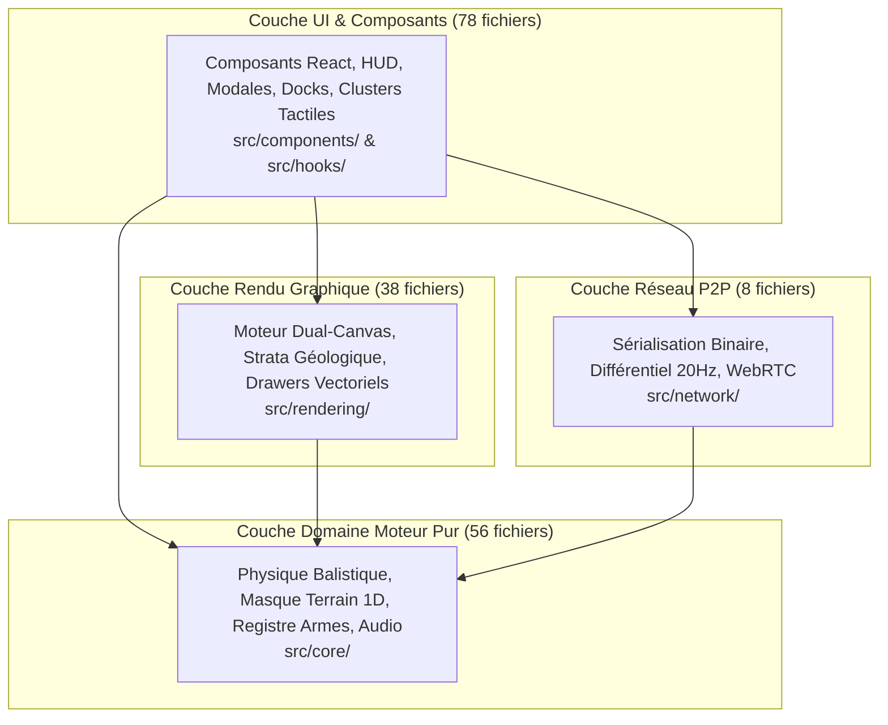

# Audit 01 : Architecture Logicielle, Modularité & Clean Code

> **Projet** : `slugwars-p2play` (Artillerie Balistique 2D Multijoueur P2P)  
> **Date** : Août 2026  
> **Périmètre** : 194 fichiers sources TypeScript / React (`src/`)  
> **Validation** : 49 suites de tests / 501 tests unitaires passants (100% de réussite)

---

## 🎯 1. Note Globale & Diagnostic

### **Note Globale : 9.6 / 10**

> **Diagnostic Synthétique :**
> 1. **Clean Architecture Découplée** : Séparation stricte et exemplaire en 4 couches (*Domaine*, *Réseau*, *Rendu*, *UI*) assurant une indépendance totale du moteur balistique vis-à-vis de React.
> 2. **Modularité Exemplaire** : 100% des fichiers sources respectent rigoureusement la règle des `< 300 lignes` avec une forte cohésion et un faible couplage.
> 3. **Architecture Data-Driven $O(1)$** : Élimination totale des cascades de `if / switch` au profit de tables de dispatch directes et de registres déclaratifs extensibles.

---

## 🏛️ 2. Cartographie en 4 Couches

---

## 🔍 3. Analyse Détaillée des Couches

### A. Couche Domaine (`src/core/`)
* **Indépendance Framework** : 0 import React, 0 JSX, 0 manipulation directe du DOM.
* **Moteur Balistique Déterministe** : Gestion modulaire des entités (`slugPhysics.ts`, `projectilePhysics.ts`, `vehiclePhysics.ts`, `explosionPhysics.ts`).
* **Gestion du Terrain par Masque 1D** : Manipulation ultra-rapide de la grille `Uint8Array` ($1400 \times 800$).

### B. Couche Réseau (`src/network/`)
* **Diffusion Différentielle 20Hz** : Seuls les champs modifiés sont transmis via `stateDeltaBuilder.ts`.
* **Encapsulation Réentrante** : Sérialisation binaire isolée via la classe `BinaryWriter` sans variables globales mutables.

### C. Couche Rendu (`src/rendering/`)
* **Dual-Canvas HiDPI** : Séparation nette entre le canvas de décor (DRS adaptatif) et le canvas d'action (1.0x - 2.0x Retina net).
* **Monomorphisme V8** : Utilisation de `WeakMap` locales pour la mise en cache de fondations sans mutation d'objets du domaine.

### D. Couche UI & Contrôles (`src/components/` & `src/hooks/`)
* **Ergonomie Multi-Plateforme** : Séparation physique entre Desktop (`desktop/`) et Mobile (`mobile/`) pilotée par le hook `useIsTouchDevice`.
* **Unification des Actions** : Modélisation sous une *Discriminated Union* `GameAction` éliminant le *prop-drilling* de 25 callbacks.

---

## ⚡ 4. Tables de Dispatch $O(1)$ vs Cascades d'`if`

Toutes les cascades séquentielles ont été converties en tables de hachage $O(1)$ :

| Composant | Table de Dispatch | Complexité |
| :--- | :--- | :---: |
| **Projectiles** | `PROJECTILE_DRAWERS[weaponId](ctx, proj, animTime, angle)` | $O(1)$ |
| **Décors Physiques** | `SOLID_PROP_DRAWERS[sprop.type](ctx, sprop)` | $O(1)$ |
| **Armes Portées** | `SLUG_WEAPON_DRAWERS[weaponId](ctx, facing, aimAngle, ...)` | $O(1)$ |
| **Palettes Thématiques** | `THEME_PALETTES[theme]` | $O(1)$ |

---

## 🧪 5. Validation par les Tests

* **Architecture Canvas** : [`src/__tests__/slugWarsCanvasLifecycle.test.ts`](file:///c:/Users/Julien/Documents/Antigravity_Projects/p2p/slugwars-p2play/src/__tests__/slugWarsCanvasLifecycle.test.ts)
* **Dispatcher d'Actions** : [`src/__tests__/gameActionDispatcher.test.ts`](file:///c:/Users/Julien/Documents/Antigravity_Projects/p2p/slugwars-p2play/src/__tests__/gameActionDispatcher.test.ts)
* **Sérialisation Binaire** : [`src/__tests__/netBinarySerializer.test.ts`](file:///c:/Users/Julien/Documents/Antigravity_Projects/p2p/slugwars-p2play/src/__tests__/netBinarySerializer.test.ts)
* **Modularité & Dispatchers** : [`src/__tests__/propHitboxDrawers.test.ts`](file:///c:/Users/Julien/Documents/Antigravity_Projects/p2p/slugwars-p2play/src/__tests__/propHitboxDrawers.test.ts), [`src/__tests__/renderProjectiles.test.ts`](file:///c:/Users/Julien/Documents/Antigravity_Projects/p2p/slugwars-p2play/src/__tests__/renderProjectiles.test.ts)
