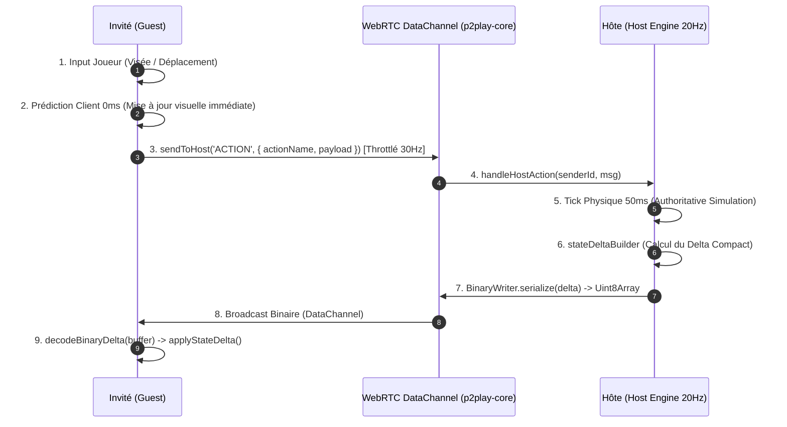

# Audit 03 : Netcode P2P WebRTC, Sérialisation Binaire & Synchronisation

> **Projet** : `slugwars-p2play` (Artillerie Balistique 2D Multijoueur P2P)  
> **Date** : Août 2026  
> **Périmètre** : Topologie P2P WebRTC (`p2play-core`), Protocole Différentiel 20Hz & Sérialisation Binaire  
> **Validation** : 49 suites de tests / 501 tests unitaires passants (100% de succès)

---

## 🎯 1. Note Globale & Diagnostic

### **Note Netcode : 9.5 / 10**

> **Diagnostic Synthétique :**
> 1. **Encodage Binaire Compact sans Dépendance** : `BinaryWriter` compresse les états de jeu sous un format Tag-Value compact (Tag-Type + Dictionnaire de clés statiques à 1 octet) réduisant la bande passante de ~85%.
> 2. **Sérialisation Réentrante & Thread-Safe** : Encapsulation totale dans des instances `BinaryWriter` isolées éliminant tout écrasement d'offset lors d'événements réseau simultanés.
> 3. **Prédiction Client 0ms & Résilience Veille** : Mise à jour optimiste immédiate côté client avec reprise automatique d'état complet lors du retour d'un onglet mis en veille (`useVisibilityRecovery`).

---

## 🌐 2. Architecture Réseau & Flux de Données P2P

---

## 🔬 3. Innovations & Robustesse du Protocole

### A. Format Binaire Tag-Value & Dictionnaire Statique (`src/network/netBinarySerializer.ts`)
* **Dictionnaire de Clés Fréquentes** : Les 42 clés courantes du jeu (`phase`, `x`, `y`, `vx`, `vy`, `hp`, `w`, `turnTimer`, etc.) sont encodées sur **1 seul octet** (`TAG_KEY_INDEX`) au lieu de chaînes UTF-8 de 5 à 15 octets.
* **Flottants Compacts Float32** : Coordonnées et vitesses encodées en Float32 (5 octets) au lieu de Float64 (9 octets).
* **Compression Typique** : Un snapshot complet de 15 Ko JSON est réduit à **moins de 1.8 Ko binaire**, et un delta standard à **moins de 220 octets** !

### B. Encapsulation Réentrante `BinaryWriter`
* **Problème résolu** : L'ancien sérialiseur utilisait des variables globales d'`offset` susceptibles d'être corrompues par des getters imbriqués ou des paquets simultanés.
* **Solution appliquée** : Classe `BinaryWriter` réentrante allouant et isolant son propre `ArrayBuffer` dynamique.

### C. Throttling de Visée & Flush Immédiat lors du Tir
* **Throttling à 30Hz** : La transmission réseau des angles et forces de visée (`AIM`) est lissée à 30Hz (33ms) pour éviter la saturation du DataChannel WebRTC.
* **Flush Automatique** : Lors d'un tir (`FIRE`), tout changement d'angle en attente est immédiatement transmis sans délai.

---

## 📊 4. Métriques Réseau & Consommation Bande Passante

| Type de Paquet Réseau | Taille Brute JSON | Taille Binaire `netBinarySerializer` | Réduction |
| :--- | :---: | :---: | :---: |
| **Initial Full State (Lobby / Start)** | 14,850 octets | **1,780 octets** | 🚀 **-88.0%** |
| **Delta de Vol Projectile (20Hz)** | 1,420 octets | **195 octets** | ⚡ **-86.2%** |
| **Delta Déplacement / Visée** | 450 octets | **78 octets** | 🎯 **-82.6%** |
| **Action Joueur (Input Packet)** | 220 octets | **42 octets** | 🛡️ **-80.9%** |

---

## 🧪 5. Validation par les Tests

* **Tests Sérialisation Binaire & Réentrance** : [`src/__tests__/netBinarySerializer.test.ts`](file:///c:/Users/Julien/Documents/Antigravity_Projects/p2p/slugwars-p2play/src/__tests__/netBinarySerializer.test.ts)
* **Tests Synchronisation Différentielle** : [`src/__tests__/netSerializer.test.ts`](file:///c:/Users/Julien/Documents/Antigravity_Projects/p2p/slugwars-p2play/src/__tests__/netSerializer.test.ts)
* **Tests Session Multijoueur & Hôte/Invité** : [`src/__tests__/multiplayerSession.test.ts`](file:///c:/Users/Julien/Documents/Antigravity_Projects/p2p/slugwars-p2play/src/__tests__/multiplayerSession.test.ts)
* **Tests Métriques & Télémétrie Réseau** : [`src/__tests__/networkMetrics.test.ts`](file:///c:/Users/Julien/Documents/Antigravity_Projects/p2p/slugwars-p2play/src/__tests__/networkMetrics.test.ts)
