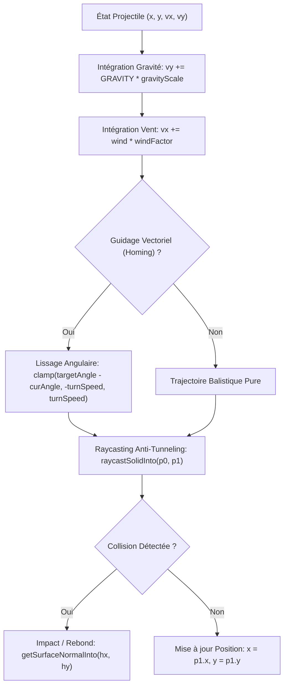

# Audit 04 : Moteur Balistique, Collisions & Déterminisme Physique

> **Projet** : `slugwars-p2play` (Artillerie Balistique 2D Multijoueur P2P)  
> **Date** : Août 2026  
> **Périmètre** : Moteur Physique 2D, Intégration Newtonienne, Raycasting Anti-Tunneling & Génération Procédurale  
> **Validation** : 49 suites de tests / 501 tests unitaires passants (100% de succès)

---

## 🎯 1. Note Globale & Diagnostic

### **Note Physique & Balistique : 9.7 / 10**

> **Diagnostic Synthétique :**
> 1. **Intégrité Balistique Déterministe** : Intégration semi-implicite à pas fixe 50ms (gravité $0.4\text{ px/tick}^2$, vent $w \times 0.02\text{ px/tick}^2$) garantissant 100% de reproductibilité entre hôte et invités.
> 2. **Raycasting Anti-Tunneling & Normales de Surface** : Détection de collision au pixel près et calcul par convolution circulaire ($r=4\text{px}$) des normales de rebond éliminant tout artefact de traversée de paroi.
> 3. **Modèle Data-Driven Universel** : Physique des armes pilotée par des propriétés déclaratives (`homingConfig`, `gravityScale`, `impactBehavior`) sans aucun `if (weaponId === ...)` dans le moteur de dynamique.

---

## ⚙️ 2. Modèle Mathématique de la Physique Balistique

---

## 🔬 3. Analyse des Algorithmes Clés

### A. Intégration Newtonienne & Constantes Physiques
* **Gravité des Limaces** : $g_{\text{slug}} = 0.40\text{ px/tick}^2$, friction au sol $\mu_{\text{slug}} = 0.85$.
* **Gravité des Projectiles** : $g_{\text{proj}} = 0.28\text{ px/tick}^2$, élasticité $\epsilon = 0.65$, friction tangentielle $\mu = 0.88$.
* **Seuil d'Arrêt au Repos** : Seuil d'évanouissement $\|\vec{v}\| < 0.25\text{ px/tick}$ éliminant tout micro-rebond résiduel.

### B. Raycasting Anti-Tunneling (`raycastSolidInto`)
* Le segment $[(x_0, y_0) \to (x_1, y_1)]$ est échantillonné en pas entiers $t = \frac{i}{\lceil\text{distance}\rceil}$.
* Même à vitesse balistique extrême ($v > 30\text{ px/tick}$), **aucun projectile ne traverse une paroi de 1 pixel**.

### C. Normales de Surface par Convolution Circulaire (`getSurfaceNormalInto`)
* Convolution discrète dans un rayon $r=4\text{px}$ calculant le gradient de masse :
$$\vec{n} = -\sum_{dx^2 + dy^2 \le r^2, \text{solide}} \frac{(dx, dy)}{\sqrt{dx^2 + dy^2}}$$
* Fournit une normale unitaire $\vec{n}$ continue et lisse sur les falaises et cratères en pixel-art.

### D. Détection d'Instabilité & Perte de Fondation
* Après chaque cratère d'explosion, les accessoires (`SolidProp`, `PlacedGirder`) scannent leurs points d'appui.
* En cas de perte d'ancrage, ils sont détruits et leurs pixels physiques sont **immédiatement purgés de la grille** pour supprimer les "hitboxes fantômes".

---

## 📊 4. Validation des 8 Archétypes Procéduraux

Tous les archétypes de terrain garantissent un déterminisme mathématique strict par graine (*seed*) :

| Archétype | Stratégie Géologique | Déterminisme Validé |
| :--- | :--- | :---: |
| **ISLAND** | Île vallonnée avec arches côtières | ✅ 100% |
| **CAVERN** | Plafond rocheux indestructible + grottes | ✅ 100% |
| **FORTRESS** | Bastions massifs et plateformes | ✅ 100% |
| **FLOATING_CHAOS** | Îlots flottants en gravité suspendue | ✅ 100% |
| **ARCHIPELAGO** | Multiples îlots étroits | ✅ 100% |
| **NATURAL_ARCHES** | Ponts naturels et surplombs | ✅ 100% |
| **SPIRES** | Aiguilles rocheuses verticales | ✅ 100% |
| **ORGANIC_CAVES** | Cavités organiques et tunnels tortueux | ✅ 100% |

---

## 🧪 5. Validation par les Tests

* **Tests Balistique & Guidage Homing** : [`src/__tests__/projectilePhysics.test.ts`](file:///c:/Users/Julien/Documents/Antigravity_Projects/p2p/slugwars-p2play/src/__tests__/projectilePhysics.test.ts)
* **Tests Collisions & Déterminisme** : [`src/__tests__/physics.test.ts`](file:///c:/Users/Julien/Documents/Antigravity_Projects/p2p/slugwars-p2play/src/__tests__/physics.test.ts)
* **Tests Cratères & Destruction de Terrain** : [`src/__tests__/terrainDestruction.test.ts`](file:///c:/Users/Julien/Documents/Antigravity_Projects/p2p/slugwars-p2play/src/__tests__/terrainDestruction.test.ts)
* **Tests Eau & Physique de Noyade** : [`src/__tests__/waterPhysics.test.ts`](file:///c:/Users/Julien/Documents/Antigravity_Projects/p2p/slugwars-p2play/src/__tests__/waterPhysics.test.ts)
