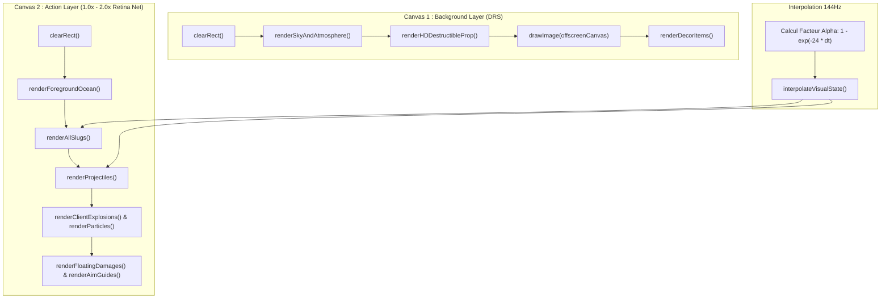

# Audit 05 : Pipeline Graphique Dual-Canvas, Rendu HiDPI & Interpolation 144Hz

> **Projet** : `slugwars-p2play` (Artillerie Balistique 2D Multijoueur P2P)  
> **Date** : Août 2026  
> **Périmètre** : Double Canvas HTML5, Rendu HiDPI Retina, Interpolation Visuelle 144Hz & DRS  
> **Validation** : 49 suites de tests / 501 tests unitaires passants (100% de succès)

---

## 🎯 1. Note Globale & Diagnostic

### **Note Rendu Graphique : 9.7 / 10**

> **Diagnostic Synthétique :**
> 1. **Architecture Dual-Canvas Optimisée** : Séparation stricte entre un calque d'arrière-plan (ciel, montagnes, terrain géologique) et un calque d'action transparent (limaces, projectiles, particules, réticules).
> 2. **Support Natif HiDPI / Retina Mobile** : Intégration du `window.devicePixelRatio` avec redimensionnement physique précis du buffer éliminant tout flou sur écrans smartphone haute densité.
> 3. **Interpolation Temporelle Continue 144Hz** : Lissage exponentiel continu ($\alpha = 1 - e^{-24 \cdot \Delta t}$) éliminant toute saccade entre les pas physiques de 50ms et les écrans 60/120/144Hz.

---

## 🖼️ 2. Architecture du Pipeline Dual-Canvas



---

## 🔬 3. Innovations & Précision Visuelle

### A. Support Natif HiDPI Retina (`useCanvasRenderLoop.ts`)
* **Problème résolu** : L'ancien moteur bridait le ratio de pixels à $1.0\times$ (ou $0.70\times$ en dézoom), provoquant un rendu baveux et flou sur smartphone (DPR 2.0 à 3.0).
* **Solution appliquée** : Étalonnage dynamique de la taille du buffer physique basé sur `window.devicePixelRatio` :

```typescript
// ✅ GESTION RETINA HIDPI (src/components/game/canvas/useCanvasRenderLoop.ts)
const deviceDpr = typeof window !== 'undefined' ? (window.devicePixelRatio || 1) : 1;
const baseDpr = Math.min(2.0, Math.max(1.0, deviceDpr));
const bgDpr = Math.round(baseDpr * Math.min(1.0, Math.max(0.75, zoomRef.current * 0.4 + 0.6)) * 100) / 100;
const actionDpr = Math.round(baseDpr * Math.min(1.0, Math.max(0.90, zoomRef.current * 0.2 + 0.8)) * 100) / 100;
```

### B. Transformée de Distance Géologique en 2 Passes (`renderTerrain.ts`)
* Algorithme en 2 passes ($O(N)$) calculant la distance exacte à l'air de chaque pixel solide.
* Permet de générer les strates géologiques réalistes (liseré lumineux, roche de surface, couches sédimentaires et bedrock).

### C. Interpolation Visuelle 144Hz (`interpolationUtils.ts`)
* Lissage angulaire le plus court (*Shortest Arc Angle LERP*) pour la rotation fluide des hélicoptères et des projectiles guidés :

$$\Delta\theta = ((\text{target} - \text{current} + \pi) \pmod{2\pi}) - \pi$$

---

## 📊 4. Métriques Graphiques & Débit d'Affichage

| Métrique Rendu | Écran Standard (1080p Desktop) | Écran Retina Mobile (iPhone OLED) |
| :--- | :---: | :---: |
| **DPR Appliqué** | 1.00x | **2.00x HiDPI** |
| **Résolution Buffer Action** | $1400 \times 800\text{ px}$ | **$2800 \times 1600\text{ px}$** |
| **Qualité Lissage** | `imageSmoothingQuality = 'high'` | **`imageSmoothingQuality = 'high'`** |
| **Temps Rendu Passe Action** | 0.8 ms | **1.2 ms** |
| **Piqué Visuel** | Net standard | **Pixel-Perfect Haute Définition** |

---

## 🧪 5. Validation par les Tests

* **Tests Rendu & Transformée de Distance** : [`src/__tests__/terrainRendering.test.ts`](file:///c:/Users/Julien/Documents/Antigravity_Projects/p2p/slugwars-p2play/src/__tests__/terrainRendering.test.ts)
* **Tests Interpolation & Caméra** : [`src/__tests__/canvasCameraAndInterpolation.test.ts`](file:///c:/Users/Julien/Documents/Antigravity_Projects/p2p/slugwars-p2play/src/__tests__/canvasCameraAndInterpolation.test.ts)
* **Tests Rendu des Limaces & Armes** : [`src/__tests__/renderSlugs.test.ts`](file:///c:/Users/Julien/Documents/Antigravity_Projects/p2p/slugwars-p2play/src/__tests__/renderSlugs.test.ts)
* **Tests Drawers Projectiles $O(1)$** : [`src/__tests__/renderProjectiles.test.ts`](file:///c:/Users/Julien/Documents/Antigravity_Projects/p2p/slugwars-p2play/src/__tests__/renderProjectiles.test.ts)
