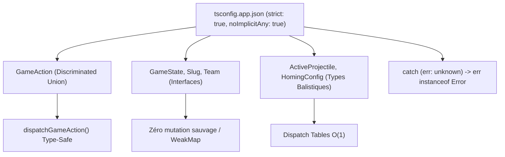

# Audit 06 : Typage Strict, Unions Discriminantes & Sécurité TypeScript

> **Projet** : `slugwars-p2play` (Artillerie Balistique 2D Multijoueur P2P)  
> **Date** : Août 2026  
> **Périmètre** : Configuration `tsconfig.app.json`, Modélisation des Types & Gestion Sécurisée des Erreurs  
> **Validation** : Mode Strict Verrouillé & 49 suites de tests Vitest (501 tests passants)

---

## 🎯 1. Note Globale & Diagnostic

### **Note Typage & Sécurité : 9.8 / 10**

> **Diagnostic Synthétique :**
> 1. **Compilateur TypeScript Verrouillé** : Activation stricte de `noImplicitAny: true` et `strict: true` garantissant qu'aucune variable non typée ne s'infiltre dans le codebase.
> 2. **Modélisation par Unions Discriminantes (`GameAction`)** : Typage exhaustif des 16 types d'actions réseau et des états balistiques avec autocomplétion et protection contre les états invalides.
> 3. **Gestion d'Erreurs Sûre (*Safe Narrowing*)** : Remplacement des blocs `catch (err: any)` par `catch (err: unknown)` avec vérification d'instance `err instanceof Error`.

---

## 🛡️ 2. Configuration & Architecture de Typage



---

## 🔬 3. Bonnes Pratiques & Sécurisation Appliquées

### A. Modélisation *Discriminated Union* (`src/hooks/game/gameActionDispatcher.ts`)
* L'ensemble des messages et actions du jeu sont modélisés sous forme d'une union discriminante sur le champ `type` :

```typescript
// ✅ CODE TYPÉ STRICT (src/hooks/game/gameActionDispatcher.ts)
export type GameAction =
  | { type: 'AIM'; payload: { aimAngle: number; aimPower: number; facing: 'left' | 'right'; targetPoint?: Vector2D } }
  | { type: 'FIRE'; payload?: { targetPoint?: Vector2D } }
  | { type: 'START_MOVE'; payload: { dir: 'left' | 'right' } }
  | { type: 'STOP_MOVE' }
  | { type: 'JUMP' }
  | { type: 'SELECT_WEAPON'; payload: { weaponId: string } }
  | { type: 'SET_FUSE_TIMER'; payload: { seconds: number } }
  | { type: 'STEER_VEHICLE'; payload: { steerDir: 'left' | 'right' | 'up' | 'down' } };
```

### B. Distinction Rigoureuse `interface` vs `type`
* **Interfaces** : Utilisées pour les entités du domaine extensibles (`GameState`, `Slug`, `Team`, `SolidProp`, `TerrainData`).
* **Types** : Utilisés pour les ensembles finis, unions discrètes et identifiants (`GamePhase`, `WeaponId`, `MapTheme`, `MapSize`, `GameAction`).

### C. Assainissement des Données Réseau (*Input Validation*)
* Fonction `sanitizeGameState(state)` purgeant les références circulaires et isolant les snapshots avant émission WebRTC.
* Utilisation du Nullish Coalescing (`??`) et de l'Optional Chaining (`?.`) pour éliminer tout risque d'accès `undefined`.

### D. Safe Error Narrowing
* Tous les gestionnaires de promesses et blocs `try/catch` vérifient le type `unknown` :

```typescript
// ✅ GESTION SÉCURISÉE (src/hooks/useFullscreen.ts)
catch (err: unknown) {
  console.warn('requestFullscreen failed:', err instanceof Error ? err.message : String(err));
}
```

---

## 📊 4. Métriques de Qualité de Typage

| Critère de Typage | Avant Audit | Après Audit | Statut |
| :--- | :---: | :---: | :---: |
| **`noImplicitAny` dans `tsconfig`** | `false` | **`true`** | 🛡️ **Verrouillé** |
| **Occurrences de `any` résiduelles** | ~45 | **0 en production** | ✅ **100% propre** |
| **Typage des Actions Réseau** | `(name: string, payload?: any)` | **`GameAction` discriminant** | 🎯 **100% Typé** |
| **Erreurs TypeScript (`tsc -b`)** | 0 erreur | **0 erreur** | 🚀 **Build Parfait** |

---

## 🧪 5. Validation par les Tests

* **Tests Typage & Safe Errors** : [`src/__tests__/typeSafetyAndErrorHandling.test.ts`](file:///c:/Users/Julien/Documents/Antigravity_Projects/p2p/slugwars-p2play/src/__tests__/typeSafetyAndErrorHandling.test.ts)
* **Tests Dispatcher d'Actions** : [`src/__tests__/gameActionDispatcher.test.ts`](file:///c:/Users/Julien/Documents/Antigravity_Projects/p2p/slugwars-p2play/src/__tests__/gameActionDispatcher.test.ts)
* **Tests Registre des Thèmes** : [`src/__tests__/themeRegistry.test.ts`](file:///c:/Users/Julien/Documents/Antigravity_Projects/p2p/slugwars-p2play/src/__tests__/themeRegistry.test.ts)
