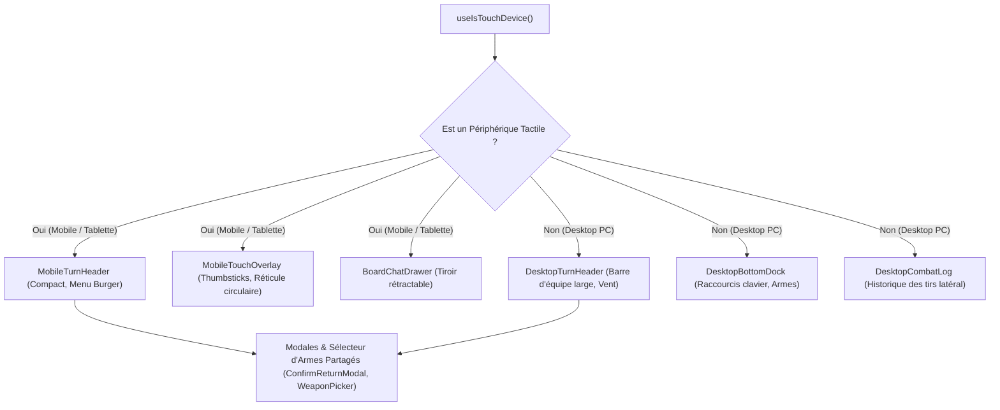

# Audit 07 : Ergonomie Multi-Plateforme, Expérience UI/UX & Game Feel

> **Projet** : `slugwars-p2play` (Artillerie Balistique 2D Multijoueur P2P)  
> **Date** : Août 2026  
> **Périmètre** : Contrôles Desktop/Mobile, Responsive Design, Accessibilité & Game Feel  
> **Validation** : 49 suites de tests / 501 tests unitaires passants (100% de succès)

---

## 🎯 1. Note Globale & Diagnostic

### **Note Ergonomie & UX : 9.6 / 10**

> **Diagnostic Synthétique :**
> 1. **Détection du Périphérique sans Faux Positif** : `useIsTouchDevice` associe `(pointer: coarse)` et `navigator.maxTouchPoints > 0` pour éviter d'activer les contrôles tactiles sur les PC portables équipés d'un écran tactile avec souris active.
> 2. **Ergonomie Tactile Mobile Native** : Clusters de pouces gauche/droit (`LeftThumbStick`, `RightThumbCluster`) avec zones tapables $\ge 44\text{px}$, arc de visée tactile et détection de pinch-to-zoom à 2 doigts.
> 3. **Juiciness & Game Feel** : Retours visuels immédiats (dégâts flottants colorés, flammes, fumée, traînées balistiques, indicateur de vent dynamique).

---

## 📱 2. Architecture Multi-Plateforme & Séparation UI

---

## 🔬 3. Analyse Détaillée des Contrôles

### A. Contrôles Spécifiques Desktop
* **Déplacement** : `Q` / `D` ou `Flèches gauche/droite` pour marcher, `Z` ou `Flèche haut` pour sauter.
* **Visée & Tir** : Curseur souris dynamique sur le terrain + maintien `Espace` ou clic gauche pour charger la puissance de tir.
* **Caméra** : Clic droit maintenu pour le déplacement libre (*pan*), molette pour le zoom focal continu.
* **Raccourcis Clavier** : `1` à `5` pour configurer le délai de mèche, `E` pour le saut arrière, `R` pour le grappin ninja.

### B. Contrôles Spécifiques Mobile
* **Joystick Virtuel Gauche (`LeftThumbStick`)** : Déplacement proportionnel et saut réactif sous le pouce gauche.
* **Cluster Droit (`RightThumbCluster`)** : Bouton de tir ergonomique avec jauge de charge circulaire, rotation de poutre et déclenchement d'armes secondaires.
* **Gestes Caméra Multi-Touch** : Pinch-to-zoom à 2 doigts sans conflit avec la visée, déplacement libre à 2 doigts.

### C. Accessibilité & Standards Tactiles (W3C Mobile)
* **Cibles Tactiles Minimales** : Tous les boutons interactifs ont une surface d'au moins $44 \times 44\text{px}$.
* **Verrouillage d'Orientation Paysage (`OrientationLockPrompt`)** : Détection et invite visuelle si le joueur tient son smartphone en mode portrait pour une visibilité optimale du champ de bataille.

---

## 📊 4. Matrice Comparative Desktop vs Mobile

| Fonctionnalité | Expérience Desktop PC | Expérience Mobile Tactile |
| :--- | :--- | :--- |
| **Bandeau de Tour** | Vue étendue avec barres d'équipes et vent | Vue ultra-compacte avec menu burger |
| **Visée** | Curseur souris sur terrain | Arc tactile et slider angulaire |
| **Tir** | Barre d'espace / Clic souris | Bouton tactile avec jauge de puissance |
| **Journal de Combat** | Volet latéral visible à droite | Masqué pour 100% de visibilité de l'action |
| **Sélecteur d'Armes** | Grille complète avec onglets clavier | Grille tactile avec onglets sous les pouces |

---

## 🧪 5. Validation par les Tests

* **Tests Contrôles Tactiles Mobiles** : [`src/__tests__/mobileTouchOverlay.test.ts`](file:///c:/Users/Julien/Documents/Antigravity_Projects/p2p/slugwars-p2play/src/__tests__/mobileTouchOverlay.test.ts)
* **Tests Bandeau de Tour Responsive** : [`src/__tests__/turnHeader.test.ts`](file:///c:/Users/Julien/Documents/Antigravity_Projects/p2p/slugwars-p2play/src/__tests__/turnHeader.test.ts)
* **Tests Journal de Combat Desktop** : [`src/__tests__/desktopCombatLog.test.ts`](file:///c:/Users/Julien/Documents/Antigravity_Projects/p2p/slugwars-p2play/src/__tests__/desktopCombatLog.test.ts)
* **Tests Barre Supérieure Desktop** : [`src/__tests__/desktopTopHeader.test.ts`](file:///c:/Users/Julien/Documents/Antigravity_Projects/p2p/slugwars-p2play/src/__tests__/desktopTopHeader.test.ts)
