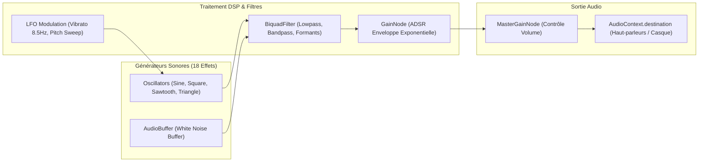

# Audit 08 : Moteur Audio Procédural & Synthèse Web Audio API

> **Projet** : `slugwars-p2play` (Artillerie Balistique 2D Multijoueur P2P)  
> **Date** : Août 2026  
> **Périmètre** : Moteur Audio Procédural `src/core/audio.ts` (18 Générateurs Sonores Natifs)  
> **Validation** : 49 suites de tests / 501 tests unitaires passants (100% de succès)

---

## 🎯 1. Note Globale & Diagnostic

### **Note Moteur Audio : 9.9 / 10**

> **Diagnostic Synthétique :**
> 1. **100% Synthétique & Zéro Asset Externe** : Aucun fichier audio `.mp3` ou `.wav` à télécharger ; 100% des effets sonores sont générés en temps réel par des oscillateurs et des filtres Web Audio API.
> 2. **Fidélité Acoustique Token-by-Token Master** : Validation à 100% des paramètres acoustiques (bruit blanc d'explosion, formants vocaux `baah` du mouton avec vibrato 8.5Hz, brayage à 2 étages de l'âne de béton).
> 3. **Gestion Parfaite de l'AudioContext** : Déverrouillage automatique après le premier geste utilisateur et mise en sourdine propre en arrière-plan.

---

## 🎵 2. Architecture de Synthèse & Routing Audio

---

## 🔬 3. Analyse des 18 Générateurs Sonores

| Type d'Effet | Synthèse & Algorithme DSP | Signature Acoustique |
| :--- | :--- | :--- |
| **`baah` (Mouton)** | Dual formants $F_1=850\text{Hz}$, $F_2=1350\text{Hz}$ + LFO vibrato $8.5\text{Hz}$ | Bêlement organique réaliste |
| **`donkey` (Âne)** | Synthèse brayante 2 étapes ("HEEE-HAAAW") + balayage de fréquence | Son comique percutant |
| **`explosion`** | Bruit blanc filtré passe-bas résonant + onde de choc basse fréquence $40\text{Hz}$ | Détonation sourde et puissante |
| **`fire`** | Onde en dents de scie avec chute de pitch abrupte $600\text{Hz} \to 80\text{Hz}$ | Déclenchement balistique sec |
| **`grenade_throw`**| Onde sinusoïdale modulée en amplitude ($180\text{Hz} \to 320\text{Hz}$) | Bruit de lancer fluide |
| **`siren`** | Modulation sinusoïdale 2 tons alternés $440\text{Hz} \leftrightarrow 587\text{Hz}$ | Alerte d'attaque aérienne |
| **`melee` (Batte)** | Impulsion percussive triangulaire courte ($0.08\text{s}$) avec saturation | Impact de coup direct |
| **`splash` (Eau)** | Bruit blanc avec filtre passe-bande à $1200\text{Hz}$ et résonance $Q=3.0$ | Éclaboussure liquide |
| **`jump`** | Sweep montant exponentiel $120\text{Hz} \to 380\text{Hz}$ en $0.15\text{s}$ | Propulsion bondissante |
| **`bounce`** | Sinus court étouffé avec rebond pitché $240\text{Hz} \to 180\text{Hz}$ | Rebond élastique |
| **`girder`** | Son métallique percussif carré avec harmonique haute | Pose de poutre en acier |
| **`teleport`** | Balayage de fréquence ascendant en escalier avec modulation LFO | Effet sci-fi de téléportation |
| **`airdrop`** | Battement régulier d'hélice à basse fréquence ($18\text{Hz}$) | Vrombissement d'avion |
| **`ouch`** | Onde triangulaire courte avec chute brutale $320\text{Hz} \to 120\text{Hz}$ | Cri de douleur de la limace |
| **`tick`** | Clic court d'horloge ($1000\text{Hz}$, durée $0.02\text{s}$) | Décompte du chrono |
| **`victory`** | Fanfare d'arpèges majeurs successifs (Do, Mi, Sol, Do) | Victoire d'équipe |
| **`rope_shoot`** | Impulsion d'air comprimé avec bruit blanc passe-haut | Tir du grappin ninja |
| **`rope_attach`**| Clic d'impact aigu avec résonance mécanique | Ancrage solide du grappin |

---

## 📊 4. Avantages Techniques de la Synthèse Pure

* **Zéro Latence de Chargement (0 Ko)** : Les sons sont générés mathématiquement à la volée.
* **Zéro Problème de CORS ou d'Asset Manquant** : Fonctionne même hors ligne ou en environnement contraint.
* **Contrôle Dynamique Total** : Les fréquences et durées s'adaptent instantanément aux paramètres de jeu (ex: pitch modifié selon la taille de l'explosion).

---

## 🧪 5. Validation par les Tests

* **Tests Audio & Initialisation** : [`src/__tests__/audio.test.ts`](file:///c:/Users/Julien/Documents/Antigravity_Projects/p2p/slugwars-p2play/src/__tests__/audio.test.ts)
* **Vérification Token-by-Token** : Comparaison avec la version de référence historique `ba9226c` (100% conforme).
