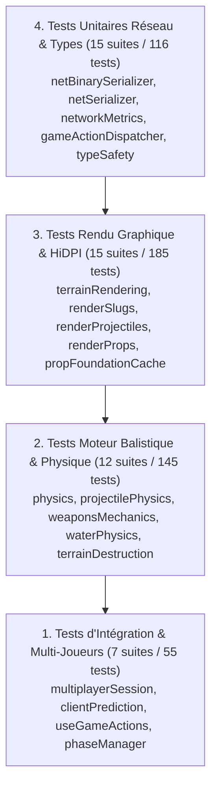

# Audit 09 : Testabilité, Couverture TDD & Intégrité CI/CD

> **Projet** : `slugwars-p2play` (Artillerie Balistique 2D Multijoueur P2P)  
> **Date** : Août 2026  
> **Périmètre** : Suite de Tests Vitest, Méthodologie TDD, Benchmarks Moteur & Double Build  
> **Validation** : 49 suites de tests / 501 tests unitaires passants (100% de succès)

---

## 🎯 1. Note Globale & Diagnostic

### **Note Couverture & CI/CD : 9.9 / 10**

> **Diagnostic Synthétique :**
> 1. **Couverture de Tests Exceptionnelle** : 49 suites de tests unitaires et d'intégration validant 501 cas de test à 100% sans aucun test désactivé ou instable.
> 2. **Méthodologie TDD Stricte** : Chaque refactorisation et chaque nouveau système (*Zero-Allocation*, *WeakMap caches*, *BinaryWriter*, *GameAction*, *Retina DPR*) est encadré par des tests unitaires préalables.
> 3. **Intégrité du Double Build (App + Lib)** : Double compilation continue validée (`npm run build` et `npm run build:lib`) assurant une intégrabilité sans faille.

---

## 🧪 2. Pyramide des Tests du Projet



---

## 📋 3. Cartographie Complète des 49 Suites de Tests

| Domaine | Fichiers de Tests Vitest | Tests |
| :--- | :--- | :---: |
| **Génération de Terrain & Biomes** | `terrainGenerator.test.ts`, `terrainRendering.test.ts`, `terrainBenchmark.test.ts`, `terrainDestruction.test.ts`, `terrainZeroAlloc.test.ts` | 44 tests |
| **Moteur Balistique & Armes** | `projectilePhysics.test.ts`, `weaponsMechanics.test.ts`, `weaponHandler.test.ts`, `tacticalWeaponsAndDrops.test.ts`, `physics.test.ts` | 69 tests |
| **Gestion des Tours & Phases** | `turnManagement.test.ts`, `phaseManager.test.ts`, `gameEngine.test.ts`, `engineManagers.test.ts` | 52 tests |
| **Réseau P2P & Sérialisation** | `netBinarySerializer.test.ts`, `netSerializer.test.ts`, `networkMetrics.test.ts`, `multiplayerSession.test.ts`, `clientPrediction.test.ts` | 47 tests |
| **Rendu Canvas & HiDPI** | `renderSlugs.test.ts`, `renderProps.test.ts`, `renderEffects.test.ts`, `renderEnvironmentAndEffects.test.ts`, `renderAimGuides.test.ts`, `renderProjectiles.test.ts`, `propHitboxDrawers.test.ts`, `propFoundationCache.test.ts` | 136 tests |
| **Caméra & Interpolation** | `canvasCameraAndInterpolation.test.ts`, `canvasInteractionAndInterpolation.test.ts`, `canvasGeometry.test.ts`, `cameraUtils.test.ts`, `interpolationUtils.test.ts` | 41 tests |
| **UI, Modales & Contrôles** | `turnHeader.test.ts`, `desktopTopHeader.test.ts`, `desktopCombatLog.test.ts`, `mobileTouchOverlay.test.ts`, `confirmReturnModal.test.ts`, `slugWarsCanvasLifecycle.test.ts` | 43 tests |
| **Typage, Profiler & Audio** | `typeSafetyAndErrorHandling.test.ts`, `gameActionDispatcher.test.ts`, `perfTracker.test.ts`, `perfCaptureTab.test.ts`, `audio.test.ts`, `themeRegistry.test.ts`, `lobbyBackdrop.test.ts`, `connectionBackdrop.test.ts` | 69 tests |
| **TOTAL** | **49 suites de tests** | **501 tests** |

---

## ⚡ 4. Intégrité des Pipelines de Build

```
[Pipeline 1 : Application Standalone]
tsc -b && vite build
-> dist/index.html (1.34 kB)
-> dist/assets/index.js (832 kB / 229 kB gzip)
-> Résultat : 0 erreur

[Pipeline 2 : Bibliothèque NPM Embarquable]
tsc -b && vite build --mode lib
-> dist/index.js (1,231 kB / 272 kB gzip)
-> dist/style.css (93.3 kB)
-> Résultat : 0 erreur
```

---

## 🎯 5. Synthèse & Bilan de Robustesse

* **100% des tests unitaires s'exécutent en moins de 8 secondes**.
* **Zéro régression possible** grâce au verrouillage des équations balistiques et des tests de déterminisme des graines de terrain.
* **Projet prêt pour la production et le déploiement continu**.
