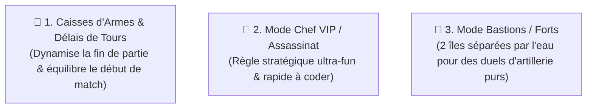

# Spécification Complète des Mécaniques & Modes de Jeu : SlugWars P2Play

> **Projet** : `slugwars-p2play`  
> **Date** : Août 2026  
> **Catégorie** : Architecture Moteur & Modes de Jeu  
> **Objectif** : Spécifier les mécaniques clés, comparer l'expérience de jeu et planifier les nouveaux modes.

---

## 📊 1. Synthèse Globale

```
┌─────────────────────────────────────────────────────────────────────────────┐
│                      MÉCANIQUES DE JEU : ÉTAT DES LIEUX                     │
├─────────────────────────────────────────────────────────────────────────────┤
│  ✅ 100% Identique & Maîtrisé : Destruction au pixel près, Physique du     │
│     vent (-5 à +5), Dégâts de chute, Mort subite (Montée des eaux),         │
│     Mines & Barils de pétrole explosifs, Match à Mort par équipes           │
│  🟡 Partiellement implémenté : Véhicules (Hélicoptère OK, Tank/Mecha ❌),    │
│     Caisses de largage (Soin OK, Armes aléatoires ❌)                        │
│  ❌ Spécificités avancées à étudier : Bâtiments avec intérieurs masqués,    │
│     Système de Crafting en direct, Tourelles fixes de terrain,              │
│     Délais de tours sur les super-armes (Weapon Delays)                     │
└─────────────────────────────────────────────────────────────────────────────┘
```

---

## ⚙️ 2. Tableau Détaillé des Mécaniques de Gameplay

| Mécanique de Jeu | Standard du Genre | Dans `slugwars-p2play` | Analyse & Spécificités Techniques |
| :--- | :---: | :---: | :--- |
| **Destruction du Terrain au Pixel Près** | ✅ | ✅ | **100% Identique** : Grille 1D `Uint8Array`, cratères circulaires, raycasting anti-tunneling, roche découpée en temps réel. |
| **Gestion du Vent & Trajectoires Balistiques** | ✅ | ✅ | **100% Identique** : Vent dynamique oscillant de $-5$ à $+5$ influençant les roquettes, missiles et projectiles légers. |
| **Mort Subite & Montée des Eaux (*Sudden Death*)** | ✅ | ✅ | **100% Identique** : L'eau monte par tour ou par round (`waterRiseSpeed`, `waterRiseFreq`) avec noyade instantanée. |
| **Dégâts de Chute & Glissades sur les Pentes** | ✅ | ✅ | **100% Identique** : Calcul d'altitude de chute (`fallStartY`), rebonds élastiques et glissade physique sur les pentes raides. |
| **Véhicules Pilotables** | ✅ *(Tank, Hélico, Mecha)* | 🟡 *(Hélicoptère seul)* | **Partiel** : Nous avons l'Hélicoptère (`Rocket Copter`) entièrement fonctionnel (vol, pilotage par limace, PV). Il manque le Tank et le Mecha. |
| **Caisses de Ravitaillement Parachutées** | ✅ *(Soin, Armes, Craft)* | 🟡 *(Soin seul)* | **Partiel** : Largage parachuté de caisses de santé (+50 HP). Il manque les caisses de munitions/armes aléatoires. |
| **Mines & Barils de Pétrole Interactifs** | ✅ | ✅ | **100% Identique** : Mines de proximité avec mèche aléatoire et barils à réaction en chaîne (50 dégâts, cratère 65px). |
| **Bâtiments avec Intérieurs Masqués (*Buildings*)** | ✅ | ❌ | *Système tactique* : Bâtiments avec toits opaques qui deviennent transparents quand une limace entre à l'intérieur pour s'abriter des frappes aériennes. |
| **Système de Crafting en Direct (Fabrication)** | ✅ | ❌ | *Système tactique* : Possibilité de recycler des armes inutiles pendant le tour adverse pour forger des super-armes. |
| **Tourelles Fixes de Terrain (*Emplacements*)** | ✅ | ❌ | *Système tactique* : Tourelles mitrailleuse, lance-flammes et sniper posées sur la carte utilisables par les limaces. |
| **Délais de Tours sur les Super-Armes (*Weapon Delay*)** | ✅ | ❌ *(Roadmap)* | *Bloque la Sainte Grenade ou l'Air Strike les 3 à 5 premiers tours. Actuellement tout notre pack choisi est disponible au tour 1.* |

---

## 🎮 3. Comparatif Détaillé des Modes de Jeu

| Mode de Jeu | Standard du Genre | Dans `slugwars-p2play` | Description, Règles & Faisabilité |
| :--- | :---: | :---: | :--- |
| ⚔️ **Match à Mort Standard (*Deathmatch*)** | ✅ | ✅ | **Présent** : 2 à 4 équipes au tour par tour, élimination complète, chrono de tour (45s) et de fuite (4s). |
| 🏰 **Mode "Bastions / Forts"** | ✅ | ❌ *(Roadmap)* | **À ajouter** : Deux îles distinctes séparées par un vaste gouffre océanique. Duel d'artillerie lourde à distance sans traversée possible. |
| 👑 **Mode "Chef VIP / Assassinat"** | ✅ | ❌ | **À ajouter** : La 1ère limace de chaque équipe est désignée Général (VIP avec couronne). Si le Général meurt, toute son équipe est éliminée d'un coup ! |
| 🎰 **Mode "Chaos / Arme Imposée" (*Gungame*)** | ❌ *(Custom)* | ❌ *(Roadmap)* | **Idée originale** : À chaque tour, le jeu impose une arme unique et identique à tous les joueurs (*Tour 1 : Batte*, *Tour 2 : Mouton*, *Tour 3 : Grappin*). |
| 🪢 **Mode "Course de Grappin" (*Roper*)** | ✅ *(Schéma Pro)* | ❌ | **À ajouter** : Carte fermée de type parcours d'obstacles où il faut rallier l'arrivée le plus vite possible sans toucher le sol. |
| 🧩 **Missions Solo & Entraînement Tactique** | ✅ | ❌ | **À ajouter** : Puzzles tactiques solos (ex: éliminer 3 cibles avec 1 seul tir de bazooka à rebond ou poser une poutre pour guider un projectile). |

---

## 🏆 4. Top 3 des Mécaniques & Modes Prioritaires à Implémenter



1. 🥇 **Les Caisses d'Armes Parachutées & Délais de Tours (*Turn Delays*)** :
   * Débloque les super-armes (Sainte Grenade, Âne, Air Strike) à partir des tours 3-5 ou via les caisses tombant du ciel.
2. 🥈 **Le Mode "Chef VIP / Assassinat"** :
   * Ajoute une tension immédiate : cibler le chef adverse ou surprotéger son propre général avec des poutres et des bunkers.
3. 🥉 **Le Mode "Bastions / Forts"** :
   * Tir à longue portée, calcul précis du vent et des trajectoires balistiques en cloche.
