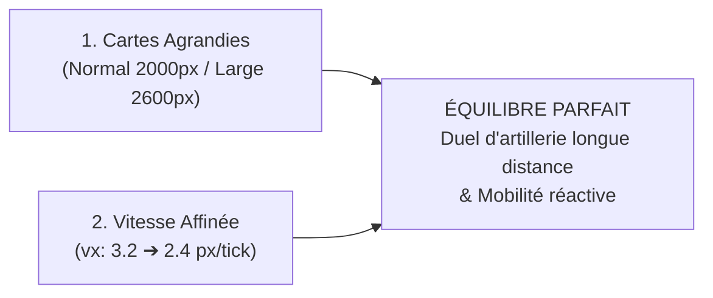

# Analyse & Équilibrage : Tailles de Cartes vs Vitesse de Déplacement

> **Projet** : `slugwars-p2play`  
> **Date** : Août 2026  
> **Catégorie** : Game Design, Équilibrage & Rythme de Jeu  
> **Objectif** : Aligner les dimensions de cartes et la vitesse des limaces sur l'expérience tactique de *Tactical Artillery*.

---

## 🏎️ 1. État des Lieux & Constat de Game Design

### A. Les Chiffres Actuels dans SlugWars P2Play
* **Vitesse de marche de la limace** : `vx = 3.2 px/tick` (à 20Hz) = **$64\text{ pixels / seconde}$**.
* **Taille de la limace** : Largeur $\approx 16\text{ pixels}$ $\implies$ **$4.0\text{ longueurs de corps par seconde}$**.
* **Dimensions de cartes actuelles** :
  * *Petite* : $1000 \times 600\text{ px}$
  * *Normale* : $1400 \times 800\text{ px}$
  * *Grande* : $2000 \times 1000\text{ px}$

```
┌─────────────────────────────────────────────────────────────────────────────┐
│                       TEMPS DE TRAVERSÉE ACTUEL                             │
│                                                                             │
│  Carte Normale (1400px) : Traversée intégrale à pied en ~21.8 secondes      │
│  Durée standard d'un tour de jeu : 45 secondes                              │
│                                                                             │
│  👉 Conséquence : Une limace a le temps de traverser DEUX FOIS l'île       │
│     complète au cours d'un seul tour de jeu !                               │
└─────────────────────────────────────────────────────────────────────────────┘
```

---

## ⚖️ 2. L'Impact sur l'Expérience Joueur (Pourquoi rééquilibrer ?)

1. **Le "Rush Dynamite / Corps-à-Corps" prédomine** :
   * Une limace peut sprinter facilement d'un bout à l'autre de la carte, poser une dynamite au contact d'un ennemi, et fuir à plus de $250\text{px}$ en 4 secondes sans prendre le moindre risque.
2. **Perte de valeur de l'Artillerie Balistique à Longue Portée** :
   * Les armes emblématiques comme le **Bazooka**, la **Grenade parabolique**, la **Frappe Aérienne** et le **Super Mouton** perdent de leur intérêt si le joueur peut simplement marcher jusqu'à l'adversaire.
3. **Sous-utilisation des Outils de Mobilité Acrobatiques** :
   * Le **Grappin Ninja**, l'**Hélicoptère** et les **Poutres** deviennent secondaires si la marche à pied est trop rapide et sans contrainte.

---

## 📊 3. Comparatif Mathématique : SlugWars vs Tactical Artillery

| Paramètre de Jeu | SlugWars P2Play (Actuel) | Tactical Artillery (Officiel) | SlugWars Rééquilibré (Cible) |
| :--- | :---: | :---: | :---: |
| **Vitesse de reptation** | **$64\text{ px/s}$** ($4.0\text{ corps/s}$) | $\approx 35\text{ px/s}$ ($1.1\text{ corps/s}$) | **$48\text{ px/s}$** ($3.0\text{ corps/s}$) |
| **Taille Carte Normale** | **$1400 \times 800\text{ px}$** | $2400 \times 1200\text{ px}$ | **$2000 \times 1000\text{ px}$** |
| **Temps de traversée (Map)** | **$21.8\text{ secondes}$** | $\approx 68\text{ secondes}$ | **$\approx 41\text{ secondes}$** |
| **Distance de fuite (Retreat 4s)** | **$256\text{ pixels}$** ($16\text{ corps}$) | $140\text{ pixels}$ ($4.5\text{ corps}$) | **$192\text{ pixels}$** ($12\text{ corps}$) |
| **Rôle de l'artillerie longue portée** | 🟡 Moyen | 🟢 Majeur | 🟢 **Majeur (Idéal tactique)** |

---

## 🛠️ 4. Propositions d'Équilibrage



### A. Recalibrage des Formats de Cartes (`MAP_SIZE_CONFIGS`)

| Format | Dimensions Actuelles | Nouvelles Dimensions Cibles | Usage & Expérience Joueur |
| :--- | :---: | :---: | :--- |
| ⚡ **Petite (SMALL)** | $1000 \times 600\text{ px}$ | **$1400 \times 800\text{ px}$** | Format ultra-nerveux pour duels 1v1 rapides et mobile. |
| ⚖️ **Normale (NORMAL)** | $1400 \times 800\text{ px}$ | **$2000 \times 1000\text{ px}$** | **Format standard recommandé** : espace tactique complet et équilibré. |
| 🗺️ **Grande (LARGE)** | $2000 \times 1000\text{ px}$ | **$2600 \times 1200\text{ px}$** | Format épique : grands reliefs, parfait pour les hélicoptères et 4 à 6 équipes. |

---

### B. Ajustement de la Vitesse de Reptation (`engineControls.ts`)
* **Vitesse actuelle** : `vx = ±3.2 px/tick`
* **Vitesse cible affinée** : `vx = ±2.4 px/tick`
  * Préserve la réactivité immédiate et le confort tactile sur smartphone.
  * Réduit la distance franchissable en un seul tour, forçant les joueurs à calculer leurs déplacements ou à utiliser le Grappin Ninja / Téléporteur.

---

## 💻 5. Analyse Technique & Performance (Mémoire & GPU)

| Échelle de Carte | Mémoire Grille `Uint8Array` | Temps de Calcul Cratère ($r=35\text{px}$) | Rendu Dual-Canvas DRS |
| :--- | :---: | :---: | :---: |
| **$1400 \times 800\text{ px}$** | **$1.12\text{ Mo}$** | $< 0.05\text{ ms}$ | 60/120 FPS constant |
| **$2000 \times 1000\text{ px}$** | **$2.00\text{ Mo}$** | $< 0.08\text{ ms}$ | 60/120 FPS constant |
| **$2600 \times 1200\text{ px}$** | **$3.12\text{ Mo}$** | $< 0.12\text{ ms}$ | 60/120 FPS constant |

> [!NOTE]
> Même à $2600 \times 1200\text{ px}$, la grille physique ne consomme que **$3.12\text{ Mo}$ de RAM**. Grâce à notre système de **Dynamic Resolution Scaling (DRS)** sur le canvas de fond, le framerate reste parfaitement stable à 60 FPS sur tous les appareils.

---

## 🎯 6. Conclusion & Recommandation
L'adoption conjointe des **cartes agrandies ($2000 \times 1000\text{ px}$ en Normal)** et de la **vitesse affinée ($2.4\text{ px/tick}$)** constitue l'équilibre parfait pour transformer `slugwars-p2play` en une véritable référence de l'artillerie tactique au tour par tour !
