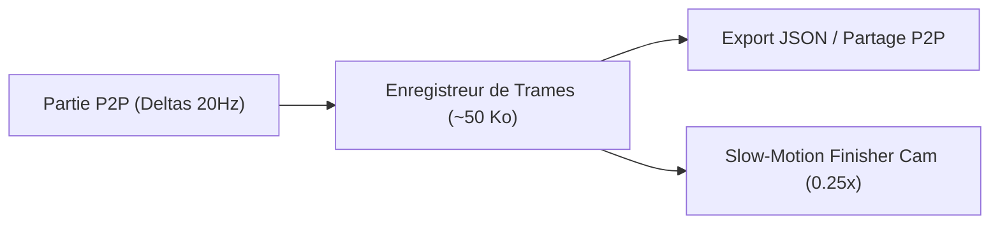

# Feuille de Route : Nouvelles Fonctionnalités, Modes de Jeu & Game Feel

> **Projet** : `slugwars-p2play`  
> **Date** : Août 2026  
> **Catégorie** : Game Design, Roadmap & Nouvelles Idées  
> **Objectif** : Enrichir le gameplay, maximiser la rejouabilité, renforcer l'immersion tactile et tirer parti du réseau WebRTC P2Play.

---

## 💣 1. Nouvel Arsenal & Gadgets Tactiques Farfelus

| Arme / Gadget | Type | Mécanique & Gameplay | Impact Tactique |
| :--- | :---: | :--- | :--- |
| 🕳️ **Le Trou Noir Miniature** | *Spécial / Gravité* | Tire une singularité gravitationnelle qui attire projectiles, débris et limaces à proximité ($r=160\text{px}$) pendant 3 secondes avant d'imploser. | Déstabilise les tirs ennemis, déloge les limaces retranchées et regroupe l'escouade adverse pour un tir groupé. |
| 🎒 **Le Jetpack Tactique** | *Utilitaire / Mobilité* | Permet de voler librement pendant 4 secondes (jauge de carburant dynamique contrôlée aux flèches/stick) avant d'activer une arme ou de poser une mine. | Permet d'atteindre des sommets rocheux inaccessibles ou de s'extirper d'une crevasse avant la montée des eaux. |
| 🌀 **Le Pistolet à Portails** | *Tactique / Téléportation* | Tire deux portails liés (Portail Bleu A et Portail Orange B) sur les parois rocheuses. Tout projectile, roquette ou limace entrant dans A ressort instantanément par B en conservant sa vitesse vectorielle. | Tirs balistiques à rebours, contournement des abris fortifiés et sauvetage d'urgence de coéquipiers. |
| ⚡ **Le Laser Orbital Solaire** | *Frappe / Destruction* | Faisceau continu descendant du ciel qui découpe une tranchée verticale droite de 40px de large dans le terrain jusqu'au niveau de l'eau. | Élimine les bunkers souterrains et noie instantanément les limaces enfouies. |
| 🧲 **La Poupée Vaudou / Télékinésie** | *Tactique / Déplacement* | Permet de saisir et déplacer une limace adverse à distance sur une courte distance sans lui infliger de dégâts directs. | Idéal pour pousser discrètement un ennemi dans l'océan ou sur une mine sans gaspiller d'explosifs. |
| 🪃 **Le Boomerang Énergétique** | *Balistique / Trajectoire* | Projectile suivant une courbe en arc de cercle qui revient vers la position du tireur en tranchant le terrain et les limaces sur son passage. | Permet de toucher des ennemis cachés derrière des surplombs rocheux sans angle de tir direct. |

---

## 🎲 2. Nouveaux Modes de Jeu & Modificateurs de Partie

### 🏰 A. Mode "Bastions / Forts"
* **Principe** : Deux îles distinctes séparées par un vaste océan infranchissable (terrain avec gouffre central).
* **Règles** : Interdiction totale de franchir le gouffre (les téléporteurs et grappins ont une portée limitée). Duel d'artillerie lourde à longue distance avec influence critique des rafales de vent.

### 🎰 B. Mode "Chaos / Arme Imposée"
* **Principe** : L'arsenal traditionnel est verrouillé. À chaque tour, le jeu impose une arme unique et identique à tous les joueurs :
  * *Tour 1* : Batte de baseball uniquement
  * *Tour 2* : Super Mouton volant
  * *Tour 3* : Grappin Ninja + Dynamite
  * *Tour 4* : Frappe Aérienne massive

### 🌧️ C. Météo Dynamique & Événements Aléatoires
* **Rafales de vent oscillantes** : Le vent change de force et de direction pendant le vol même du projectile.
* **Pluies de météorites** : Chute aléatoire de 3 petits fragments rocheux explosifs en début de tour.
* **Marée accélérée** : L'eau monte de façon continue et imprévisible lors de la phase de mort subite.

---

## 🎬 3. Replay P2P & Ralenti de Fin de Partie (Highlights)

### 🎥 A. Slow-Motion Finisher Cam
* Zoom cinématographique automatique ralenti à $0.25\times$ avec effet dramatique lors du tir ou de la projection qui élimine la toute dernière limace de la partie.

### 💾 B. Lecteur de Replay P2P Ultra-Léger
* Comme le jeu s'appuie sur une simulation déterministe et des deltas d'actions compacts, l'historique complet d'une partie de 15 minutes ne pèse que **~50 Ko**.
* **Fonctionnalités** :
  * Lecture, pause, rembobinage coup par coup.
  * Vitesse réglable ($0.5\times$, $1\times$, $2\times$, $4\times$).
  * Export du fichier replay `.slugreplay` ou partage direct via code de salle WebRTC.

---

## 🔊 4. Voix Synthétisées & Personnalisation P2P

### 🗣️ A. Banques de Voix Procédurales (100% Web Audio, 0 Ko de fichiers)
* Utilisation d'oscillateurs modulés en fréquence et de filtres formants pour générer 4 banques vocales distinctes :
  1. 👶 **La Limace Farfelue / Aiguë** (Pitch élevé, glissando comique)
  2. 🪖 **Le Guerrier Bourru** (Ondes carrées graves avec saturation)
  3. 🤖 **Le Robot Cyber-Slug** (Ring modulator, son métallique)
  4. 🤠 **Le Cowboy Décalé** (Tremolo western, sifflet synthétique)
* **Événements déclencheurs** : Sélection d'arme, saut, tir, compte à rebours de mèche (*"3, 2, 1..."*), noyade (*"Plouf !"*), et victoire.

### 🪦 B. Pierres Tombes & Drapeaux d'Équipe
* Lors de l'élimination d'une limace, une stèle funéraire ou un fanion aux couleurs de l'équipe reste ancré physiquement dans le décor avec détection de collision physique.

---

## 📳 5. "Game Feel" & Immersion Sensorielle (Juiciness)

* 💥 **Secousse d'écran Directionnelle (Screen Shake)** :
  * Décalage d'offset de caméra $(dx, dy)$ proportionnel à la proximité et au rayon de chaque détonation :
    $$\text{Shake} = \text{BlastRadius} \times 0.25 \times \left(1 - \frac{\text{Distance}}{\text{MaxDist}}\right)$$
* 📳 **Retour Haptique Mobile (Vibrations)** :
  * Tir au fusil / bazooka : impulsion brève `navigator.vibrate([25])`.
  * Explosion de dynamite / baril de pétrole : triple impulsion lourde `navigator.vibrate([50, 30, 80])`.
  * Dégâts reçus par sa propre limace : vibration saccadée d'alerte `navigator.vibrate([40, 20, 40])`.

---

## 📋 6. Matrice de Priorisation & Complexité

| Fonctionnalité | Fun / Valeur Ajoutée | Complexité Technique | Effort Estimé |
| :--- | :---: | :---: | :---: |
| 📳 **Screen Shake & Retour Haptique Mobile** | ⭐⭐⭐⭐⭐ | 🟢 Faible | ~45 min |
| 🕳️ **Le Trou Noir Miniature & Jetpack** | ⭐⭐⭐⭐⭐ | 🟡 Moyenne | ~1h30 |
| 🎥 **Slow-Motion Finisher Cam** | ⭐⭐⭐⭐ | 🟢 Faible | ~45 min |
| 🗣️ **Voix Synthétisées Web Audio (0 Ko)** | ⭐⭐⭐⭐⭐ | 🟡 Moyenne | ~1h15 |
| 🏰 **Mode "Bastions / Forts"** | ⭐⭐⭐⭐ | 🟢 Faible | ~45 min |
| 💾 **Système de Replay P2P (.slugreplay)** | ⭐⭐⭐⭐ | 🔴 Élevée | ~2h30 |
| 🌀 **Le Pistolet à Portails** | ⭐⭐⭐⭐⭐ | 🔴 Élevée | ~3h00 |
