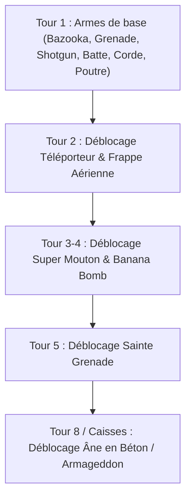

# Feuille de Route : Nouvelles Fonctionnalités, Modes de Jeu & Game Feel

> **Projet** : `slugwars-p2play`  
> **Date** : Août 2026  
> **Catégorie** : Game Design, Roadmap & Nouvelles Idées  
> **Inspirations** : Artillerie Balistique 2D, *Portal (Valve)*, Stratégie Tour par Tour

---

## ⏳ 1. Mécanique Tactique : Délais de Tours & Caisses d'Armes

Dans les règles de tournoi et de match équilibré, **toutes les armes ne sont PAS disponibles au tour 1**. Le système repose sur 3 paramètres par arme :
1. **Stock initial** : Quantité de munitions au départ (ou $\infty$ pour le bazooka, la grenade et le skip turn).
2. **Délai de déblocage (*Turn Delay*)** : Nombre de tours obligatoires avant que l'arme ne devienne sélectionnable dans la roue d'armes (affichée grisée avec un badge `[3]` par exemple).
3. **Taux d'apparition en caisse (*Crate Probability*)** : Chance qu'une caisse parachutée du ciel contienne cette arme.

### Table des Délais Recommandés pour `slugwars-p2play` :

| Arme | Munitions Début | Délai de Tours (*Turn Delay*) | Probabilité en Caisse |
| :--- | :---: | :---: | :---: |
| 🚀 **Bazooka** | $\infty$ | **0 (Immédiat)** | — |
| 💣 **Grenade classique** | $\infty$ | **0 (Immédiat)** | — |
| 💥 **Fusil à pompe (Shotgun)** | 4 | **0 (Immédiat)** | 25% |
| ⚾ **Batte de baseball** | $\infty$ | **0 (Immédiat)** | — |
| 🪢 **Grappin Ninja (Ninja Rope)** | $\infty$ | **0 (Immédiat)** | — |
| 🪜 **Poutre métallique (Girder)** | 3 | **0 (Immédiat)** | 20% |
| 🔥 **Chalumeau (Blowtorch)** | 2 | **0 (Immédiat)** | 20% |
| 🧨 **Dynamite** | 2 | **Tour 1** | 15% |
| 🌀 **Pistolet à Portails (Portal Gun)** | 2 | **Tour 2** | 15% |
| ✈️ **Frappe Aérienne (Air Strike)** | 1 | **Tour 3** | 10% |
| 🐑 **Super Mouton (Super Sheep)** | 1 | **Tour 3** | 10% |
| 🍌 **Banana Bomb** | 1 | **Tour 4** | 10% |
| ✝️ **Sainte Grenade (Holy Hand Grenade)** | 1 | **Tour 5** | 5% |
| 🫏 **Âne en Béton (Concrete Donkey)** | 0 | **Tour 8 / Caisses Uniquement** | 5% |

---

## 🌀 2. Le Pistolet à Portails (*Portal Gun*)

> [!NOTE]
> **Fonctionnement dans l'Arène & Adaptation pour SlugWars** :
> 1. **Tir 1 (Portail Bleu)** : Le joueur vise une paroi rocheuse et pose l'entrée du portail.
> 2. **Tir 2 (Portail Orange)** : Le joueur tire la sortie du portail sur un autre point de la carte.
> 3. **Physique quantique** :
>    * Tout **projectile** (roquette de bazooka, grenade dégoupillée, dynamite lancée) qui percute le portail A est instantanément téléporté au portail B et en ressort avec sa vélocité orientée selon la normale de sortie.
>    * Toute **limace** sautant ou chutant dans un portail traverse l'espace et ressort de l'autre côté !

---

## 💣 3. Nouvel Arsenal & Gadgets Tactiques Farfelus

| Arme / Gadget | Type | Mécanique & Gameplay | Impact Tactique |
| :--- | :---: | :--- | :--- |
| 🕳️ **Le Trou Noir Miniature** | *Spécial / Gravité* | Tire une singularité gravitationnelle qui attire projectiles, débris et limaces à proximité ($r=160\text{px}$) pendant 3 secondes avant d'imploser. | Déstabilise les tirs ennemis, déloge les limaces retranchées et regroupe l'escouade adverse pour un tir groupé. |
| 🎒 **Le Jetpack Tactique** | *Utilitaire / Mobilité* | Permet de voler librement pendant 4 secondes (jauge de carburant dynamique contrôlée aux flèches/stick) avant d'activer une arme ou de poser une mine. | Permet d'atteindre des sommets rocheux inaccessibles ou de s'extirper d'une crevasse avant la montée des eaux. |
| ⚡ **Le Laser Orbital Solaire** | *Frappe / Destruction* | Faisceau continu descendant du ciel qui découpe une tranchée verticale droite de 40px de large dans le terrain jusqu'au niveau de l'eau. | Élimine les bunkers souterrains et noie instantanément les limaces enfouies. |
| 🧲 **La Poupée Vaudou / Télékinésie** | *Tactique / Déplacement* | Permet de saisir et déplacer une limace adverse à distance sur une courte distance sans lui infliger de dégâts directs. | Idéal pour pousser discrètement un ennemi dans l'océan ou sur une mine sans gaspiller d'explosifs. |
| 🪃 **Le Boomerang Énergétique** | *Balistique / Trajectoire* | Projectile suivant une courbe en arc de cercle qui revient vers la position du tireur en tranchant le terrain et les limaces sur son passage. | Permet de toucher des ennemis cachés derrière des surplombs rocheux sans angle de tir direct. |

---

## 🎲 4. Nouveaux Modes de Jeu & Modificateurs

### 🏰 A. Mode "Bastions / Forts"
* Deux îles distinctes séparées par un vaste océan infranchissable. Duel d'artillerie lourde à longue distance avec influence critique des rafales de vent.

### 🎰 B. Mode "Chaos / Arme Imposée"
* À chaque tour, le jeu impose une arme unique et identique à tous les joueurs (*Tour 1 : Batte de baseball*, *Tour 2 : Super Mouton*, *Tour 3 : Grappin Ninja + Dynamite*).

### 🌧️ C. Météo Dynamique & Événements Aléatoires
* Rafales de vent changeantes en vol, pluies de micro-météorites et marée montante continue en mort subite.

---

## 🎬 5. Replay P2P & Ralenti de Fin de Partie (Highlights)

* 🎥 **Slow-Motion Finisher Cam** : Zoom dramatique ralenti à $0.25\times$ lors du coup fatal éliminant la dernière limace de la partie.
* 💾 **Lecteur de Replay P2P (< 50 Ko)** : Enregistrement de la session déterministe avec lecture, pause et export `.slugreplay`.

---

## 🔊 6. Voix Synthétisées & Immersion Sensorielle

* 🗣️ **4 Banques Vocales Procédurales (Web Audio, 0 Ko)** : *Limace Aiguë/Farfelue*, *Guerrier Bourru*, *Robot Cyber-Slug*, *Cowboy Western*.
* 🪦 **Pierres Tombes Physiques** ancrées dans le décor lors de l'élimination d'une limace.
* 💥 **Screen Shake** : Secousse de caméra proportionnelle à la puissance des explosions.
* 📳 **Retour Haptique Mobile** : Vibrations smartphone (`navigator.vibrate`) sur les tirs et impacts.

---

## 📋 7. Matrice de Priorisation & Complexité

| Fonctionnalité | Fun / Valeur Ajoutée | Complexité Technique | Effort Estimé |
| :--- | :---: | :---: | :---: |
| ⏳ **Délais de Tours (*Turn Delay*) & Caisses** | ⭐⭐⭐⭐⭐ | 🟢 Faible | ~30 min |
| 📳 **Screen Shake & Retour Haptique Mobile** | ⭐⭐⭐⭐⭐ | 🟢 Faible | ~45 min |
| 🕳️ **Le Trou Noir Miniature & Jetpack** | ⭐⭐⭐⭐⭐ | 🟡 Moyenne | ~1h30 |
| 🎥 **Slow-Motion Finisher Cam** | ⭐⭐⭐⭐ | 🟢 Faible | ~45 min |
| 🗣️ **Voix Synthétisées Web Audio (0 Ko)** | ⭐⭐⭐⭐⭐ | 🟡 Moyenne | ~1h15 |
| 🏰 **Mode "Bastions / Forts"** | ⭐⭐⭐⭐ | 🟢 Faible | ~45 min |
| 💾 **Système de Replay P2P (.slugreplay)** | ⭐⭐⭐⭐ | 🔴 Élevée | ~2h30 |
| 🌀 **Le Pistolet à Portails (Portal Gun)** | ⭐⭐⭐⭐⭐ | 🔴 Élevée | ~3h00 |
